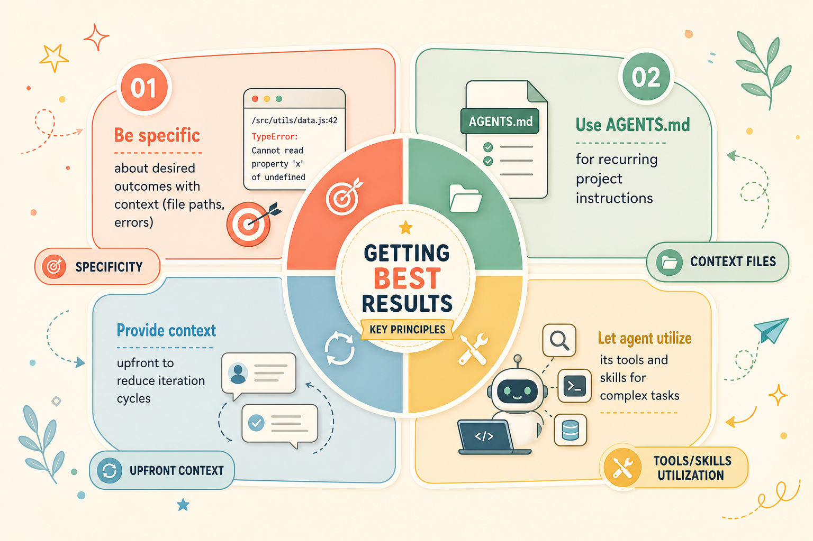
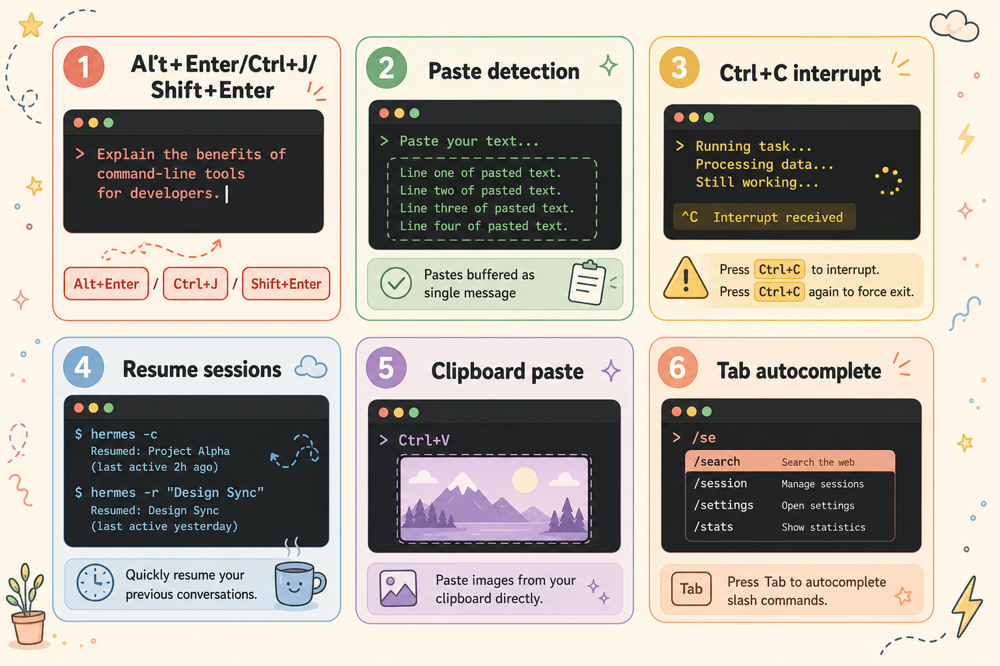
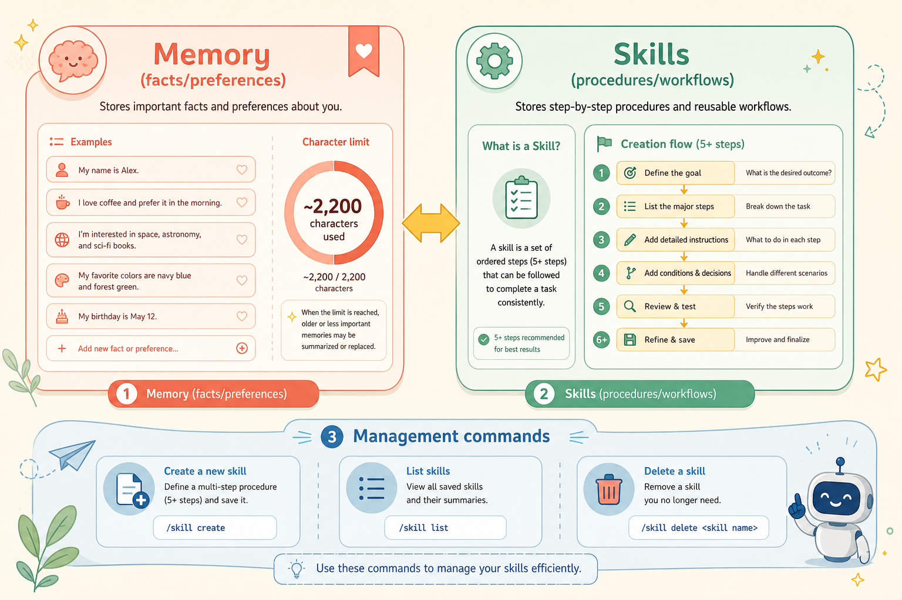
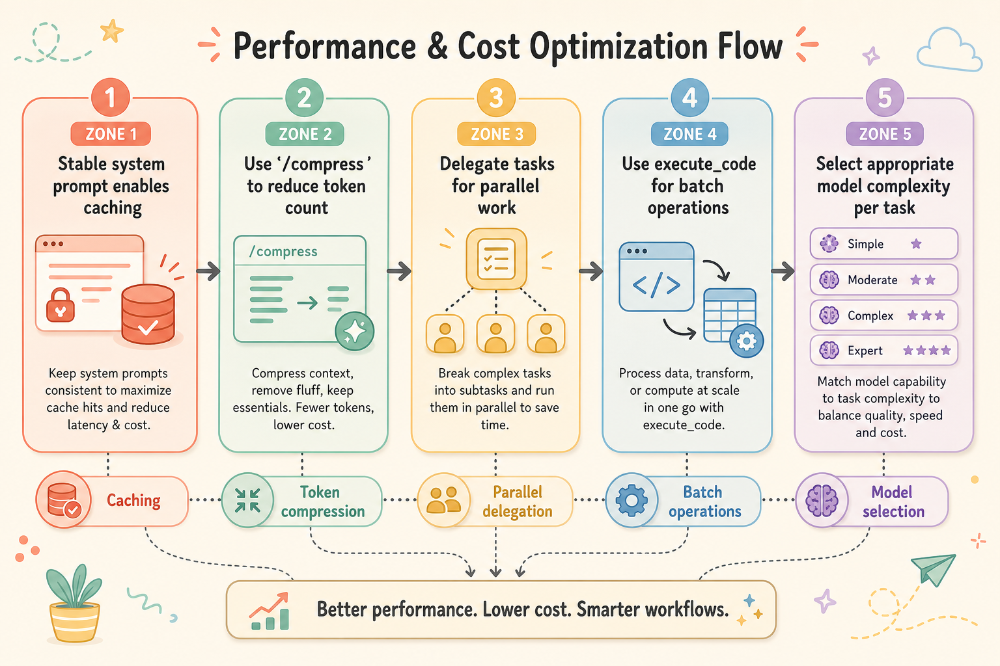

# Hermes Agent Tips & Best Practices Summary

Disclaimer: Source linked at bottom. Illustrations created by me.

## Getting Best Results

- Be specific about desired outcomes with context (file paths, errors)
- Use AGENTS.md for recurring project instructions
- Let agent utilize its tools and skills for complex tasks
- Provide context upfront to reduce iteration cycles

## CLI Power User Tips

- Multi-line input: Alt+Enter, Ctrl+J, or Shift+Enter
- Paste detection: pastes buffered as single message
- Interrupt with Ctrl+C (double for force exit)
- Resume sessions with hermes -c or hermes -r "title"
- Clipboard image paste via Ctrl+V
- Slash command autocomplete with Tab

## Context Files

- AGENTS.md: project-specific instructions (auto-loaded)
- SOUL.md: global personality customization
- .cursorrules compatibility
- Lazy loading of subdirectory AGENTS.md during tool calls

## Memory & Skills

- Memory: facts/preferences (~2,200 chars)
- Skills: procedures/workflows
- Create skills for repeated 5+ step tasks
- Manage memory via "clean up memory" commands
- Agent remembers key takeaways when prompted

## Performance & Cost

- Stable system prompt enables caching
- Use /compress to reduce token count
- Delegate tasks for parallel work
- Use execute_code for batch operations
- Select appropriate model complexity per task

## Messaging Tips

- Set home channel for proactive outputs
- Use /title to organize sessions
- DM pairing for secure team access
- Control tool visibility with /verbose

## Security

- Use Docker sandbox for untrusted code
- Windows: enforce UTF-8 encoding
- Review before "always" approving dangerous commands
- Command approval safety net (skip in containers)
- Use platform-specific allowlists for bots

Source > https://hermes-agent.nousresearch.com/docs/guides/tips