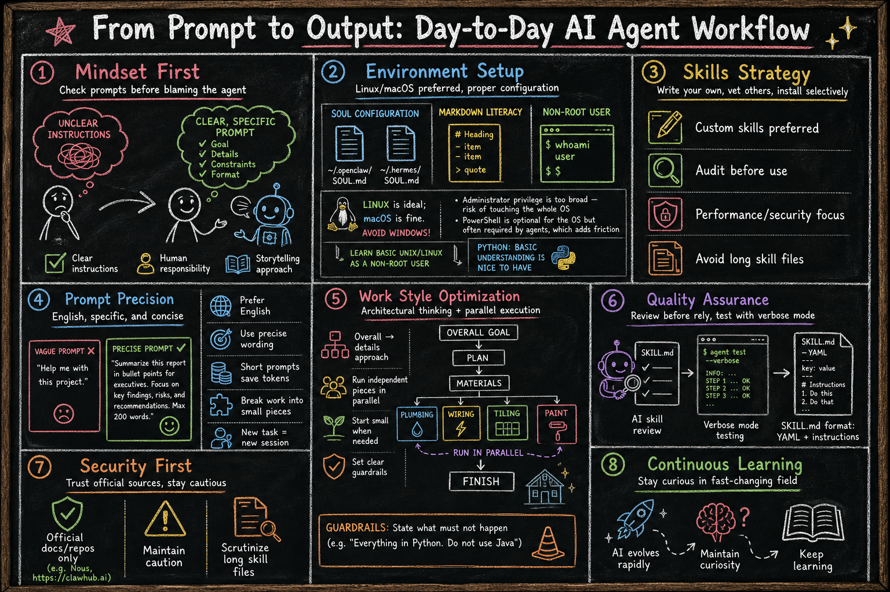

# From Prompt to Output: Day-to-Day AI Agent Workflow

## 1. Mindset
- When the result/output isn't satisfactory, check the **prompt** first — unclear instructions are usually the human's error, not the agent's
- Tell the story clearly, one chapter at a time.
<!-- - 其实就是把故事讲清楚，比如，曹雪芹的红楼梦。一个章节一个章节地讲述-->

## 2. Environment (Pre-requisites)
- Update `~/.openclaw/SOUL.md` and `~/.hermes/SOUL.md` if there isn't, to make the agent more specific
- Understand markdown
- **Linux** is ideal; **macOS** is fine. Avoid running agents on **Windows**:
  - Administrator privilege is too broad — risk of touching the whole OS
  - PowerShell is optional for the OS but often required by agents, which adds friction
- Learn basic Unix/Linux as a **non-root** user
- Python: basic understanding is nice to have
- **Result filename convention** (OpenClaw and Hermes): `YYMMDD` + time + topic + subtopic, e.g. `2605211430-report-summary.md`
  - Avoid spaces in filenames
  - Know where to save outputs. Default agent paths: `~/.openclaw`, `~/.hermes` (config, skills, state, including conversation history and output files)

## 3. Skills (personal opinion)
- Write my own most of the time
- Read others at https://clawhub.ai, https://www.skills.sh and https://hermes-agent.nousresearch.com/docs/skills
- Understand exactly what each installed skill does before you rely on it
- Install skills and plugins **only** when needed — performance and security. **Skills**: AI chooses when to use. **Plugins**: auto hooks (e.g. email) without AI choosing.
- Be skeptical of **long skill files**; harder to audit and more likely to hide unwanted behavior

## 4. Prompts and Language
- Prefer **English** for prompts (vs Chinese or others) when you need precision
- Use precise wording; cross-check with tools like Gemini or Perplexity if needed
- Keep **prompts** short and precise — saves tokens and reduces errors
- Break work **from large to small** (goal → steps → single tasks)
- No duplicated messages in the same session
- **New task → new session** — unrelated history gets loaded as prompt context
- Do not keep correcting an old prompt; that confuses the agent. Start fresh instead

## 5. Work Style
- **Architectural thinking**: overall → details, step by step (e.g. build a house: plan → materials → foundation → plumbing, wiring, tiling, paint → finish)
- Run independent pieces **in parallel** (e.g. plumbing, wiring, tiling at the same time)
- Break work into small pieces when it cannot be done in one shot; start small
- **Guardrails**: state what must not happen (e.g. "Everything in Python. Do not use Java")

## 6. Quality and Testing
- Let AI review your `SKILL.md` before you rely on it
- Enable verbose mode and watch the test run
- **SKILL.md**: standard skill markdown — YAML frontmatter + declarative human-language instructions

## 7. Security
- Trust **official docs and repos** only (e.g. Nous, https://clawhub.ai)
- Stay cautious always
- Trust less when skill files are very long — read before install

## 8. Closing Note
- AI and agents change fast — stay curious and keep learning
