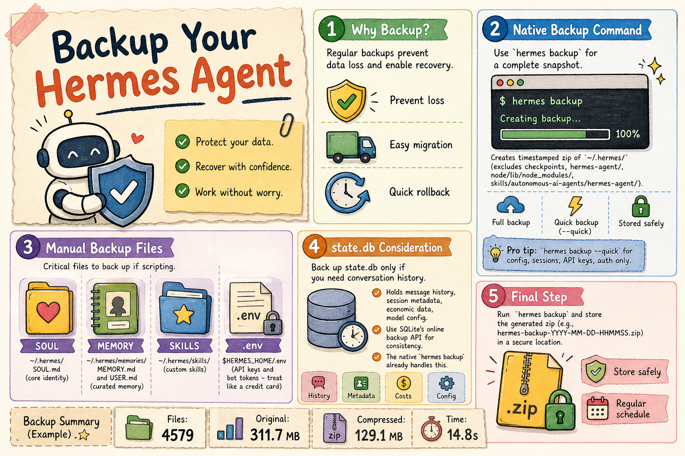

# Backup Hermes Agent



**Key idea:** Back up your `~/.hermes` directory regularly. Use `hermes backup` for a full snapshot, or `hermes backup --quick` for just the critical files. Store the zip somewhere safe.

## Why You Should Backup Regularly

You've heard it a thousand times — back up your data. I run mine daily. Here's why it matters:

- Back up before things go wrong (crashes happen)
- Migrate to a new machine when you upgrade
- Roll back when something breaks

## Back Up Your Current Hermes Data

### Native backup command in Hermes

Hermes stores its core memory, persona, and configs in `~/.hermes/`.

The built-in CLI creates a complete, timestamped archive:

```bash
hermes backup
```

You'll see something like:

```sh
hermes backup
Scanning ~/.hermes ...
Backing up 4579 files ...
  500/4579 files ...
  ...
  4500/4579 files ...

Backup complete: /home/jeff/hermes-backup-2026-06-01-101955.zip
  Files:       4579
  Original:    311.7 MB
  Compressed:  129.1 MB
  Time:        14.8s

  Excluded directories:
    checkpoints/
    hermes-agent/
    node/lib/node_modules/
    skills/autonomous-ai-agents/hermes-agent/

Restore with: hermes import hermes-backup-2026-06-01-101955.zip
```

**Pro tip:** If you only need the essentials — config, sessions, API keys, and auth — use the `--quick` flag. It's way faster and skips the full file scan:

```bash
hermes backup --quick
```

The native command uses SQLite's `backup()` API under the hood, so it works safely even when Hermes is running.

### Manual / Scripted Backup

If you want to roll your own backup script, grab these files:

- **`~/.hermes/SOUL.md`** — your agent's core identity (personality, tone, boundaries)
- **`~/.hermes/memories/MEMORY.md`** and **`~/.hermes/memories/USER.md`** — the agent's curated cross-session memory: environment facts, conventions, and your personal preferences
- **`~/.hermes/skills/`** — custom skills and auto-learned capabilities
- **`$HERMES_HOME/.env`** — API keys and bot tokens. Treat this like a credit card. When Hermes asks for permission to read it — so it can reach models outside your local network — make sure you understand what you're approving. In most cases I only grant access once.

The native `hermes backup` command already handles all of the above. But if you're scripting it yourself, or you want extra control over what goes where, these are the critical pieces.

#### A note about skills and cache output

Custom skills sometimes dump their output (generated articles, images, etc.) into `~/.hermes/skills/` or `~/.hermes/cache/` if the skill didn't specify an output directory. This is easy to miss — you might not even find those files after the job finishes. Check both directories if you're looking for something a skill produced.

## `~/.hermes/state.db` — Should You Back It Up?

You probably don't need to back up the database if you just chat. But if you care about your conversation history — say you want to search past sessions or build a **semantic index** — then definitely keep a copy. Here's what's inside:

### Core data categories

The database holds:

- **Message History** — every user message, agent reply, reasoning step, tool call, and tool result
- **Session Metadata** — IDs, titles, source platforms (CLI, Telegram, Discord, etc.), timestamps
- **Economic Data** — input/output token counts and estimated dollar cost per session
- **Model Configuration** — the model name, system prompt, and config used for each session

### Database structure

From the official docs, the schema has:

- **`sessions`** — metadata, token counts, billing info
- **`messages`** — full message history per session
- **`messages_fts`** / **`messages_fts_trigram`** — FTS5 virtual tables for fast full-text search across every conversation
- **`state_meta`** — a simple key-value table for general metadata

If you do decide to back it up, always use SQLite's online backup API instead of a direct file copy — that keeps the database consistent. The native `hermes backup` command already handles this for you.

So go run `hermes backup` and store that zip somewhere safe.
