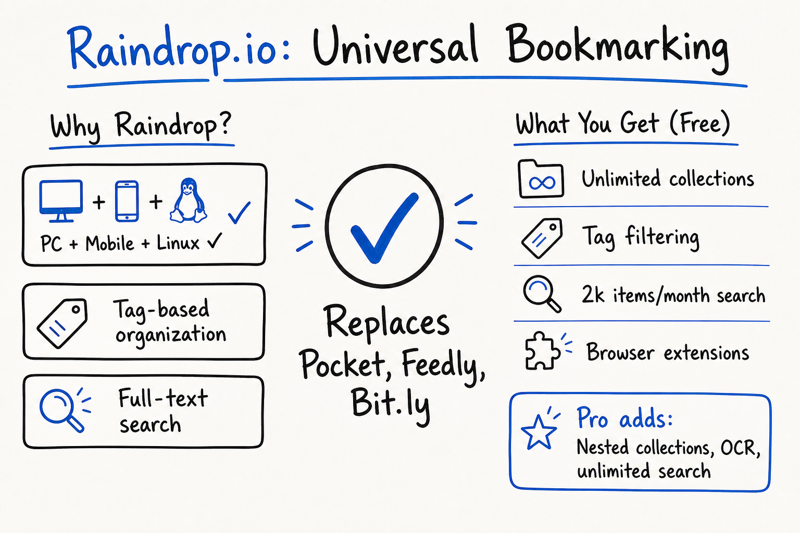

# Raindrop.io Review: Universal Bookmarking on PC, Mobile, and Linux

## Disclaimer
- No affiliation with Raindrop.
- Free plan user only — no Pro experience.

---

## Background: Why Switch?

### Primary Goal
Find a **universal bookmark app** available on **PC (Windows/macOS), Mobile (iOS/Android), and Linux** — all with full feature parity (offering the same core features and user experience across these platforms).

Raindrop is the only one meeting all three platforms natively.

### Trigger: Pocket Sunset
Used **[Firefox Pocket](https://getpocket.com/) for years** until Mozilla sunset it (~2-3 years ago). This forced migration to a service that:
- Works everywhere (PC + Mobile + Linux)
- **Tag-based organization**: save one URL with multiple tags → search/filter by tag
- Not tied to a browser vendor

### Previous Tools & Pain Points
| Tool | Role | Cost | Platform Support | Pain Point |
|------|------|------|------------------|------------|
| **[Firefox Pocket](https://getpocket.com/)** | Read-later + tags | Free | Windows/macOS/iOS/Android | Sunset by Mozilla; no Linux desktop app |
| **[Feedly](https://feedly.com/)** | RSS aggregation | Free/Paid | Windows/macOS/iOS/Android | No long-term save/search; items expire |
| **[Bit.ly](https://bitly.com/)** | Link shortening | Free/Paid | Web, browser extensions | No organization, no content capture |
| **Browser bookmarks** | Ad-hoc saving | Free | All browsers, desktop | Flat, no tags, no full-text search |
| **[Pinboard](https://pinboard.in/)** | Bookmarking | Paid ($11/yr + $25 archiving) | Web, iOS (unofficial), no Linux | No official mobile/Linux apps |
| **[Wallabag](https://www.wallabag.org/)** | Self-hosted read-later | Free/Paid (hosting) | Cross-platform (Web, mobile apps) | Self-host burden, no native Linux desktop |

## Raindrop — Core Features Used

- **Collections** (nested) — replace [Feedly](https://feedly.com/) boards + browser folders
- **Tags** — cross-collection filtering
- **Full-text search** — including OCR on images/PDFs
- **Browser extension** — one-click save, highlight, screenshot
- **Import/Export** — markdown, JSON, HTML
- **Mobile app** — offline read, quick capture

---

## User Experience & Usability
- The UI is clean, responsive, and intuitive on all platforms.
- App performance is generally smooth with quick sync across devices.
- Occasional minor delays occur with large collections or batch operations.
- The mobile app offers offline reading, but some features feel less optimized on smaller screens.
- Browser extensions integrate seamlessly for one-click saving and annotation.
- Overall, user feedback highlights a strong, consistent experience across platforms with small areas for improvement.

- **Collections** (nested) — replace [Feedly](https://feedly.com/) boards + browser folders
- **Tags** — cross-collection filtering
- **Full-text search** — including OCR on images/PDFs
- **Browser extension** — one-click save, highlight, screenshot
- **Import/Export** — markdown, JSON, HTML
- **Mobile app** — offline read, quick capture

---

## Free vs Pro Limits (as of 2026-06)
| Feature | Free | Pro |
|---------|------|-----|
| Collections | Unlimited | Unlimited |
| Nested collections | ❌ | ✅ |
| Full-text search | 2k items/mo | Unlimited |
| OCR | ❌ | ✅ |
| Batch ops | Limited | Full |
| Backup/export | Manual | Auto + API |

---

## Open Source & Transparency
- Raindrop.io is open source, with its client applications' source code publicly available on GitHub.
- The repositories cover all clients: web, browser extensions, iOS, Android, and desktop apps.
- This transparency allows for community contributions, audits, and trust in the software's development.
- GitHub link: https://github.com/raindropio

---

## Security & Privacy (verified 2026-06)
- Raindrop.io runs on AWS servers located in Frankfurt, Germany, with data replicated threefold across data centers for redundancy.
- All connections to the service are encrypted over HTTPS with RSA 2048-bit keys, supporting Perfect Forward Secrecy and SHA-256 digests, resulting in a Qualys SSL rating of "A".
- Your data is continuously backed up and can be restored to any point within the past year.
- Collections and files are private by default; file share links are temporary, expiring after 10 minutes.
- Two-factor authentication (2FA) is available for added login security.
- Operates on a bootstrapped revenue model with no investors, no ads, no data mining, nor selling of user data.
- All client applications are open source and available on GitHub for community inspection and contribution.
- Raindrop maintains SOC 2 Type II compliance as an additional security measure.
- Full privacy policy and terms of service available on Raindrop's official site.

## Verdict
- Replaces [Feedly](https://feedly.com/) "save for later" + [Bit.ly](https://bitly.com/) + bookmarks
- Free tier sufficient for my case
- Pro worth it if: nested collections, OCR, unlimited search needed