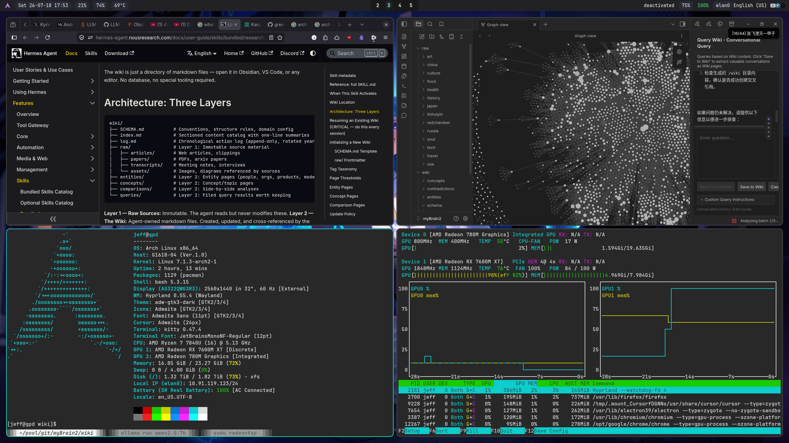

# Build Your Own AI-Powered Wiki with Obsidian + Karpathy LLM Wiki + Ollama


## Introduction

I've kept 330+ notes for years. Two years ago, I migrated from **Evernote** to **Obsidian** to build my own wiki/ knowledge base from multi-year saved documents. Not only technical ones, but any personal interests—how to fly DCS, riding motorcycles in mountains, photograph techniques—in both English and Chinese.

I can query and chat with my wiki, pulling related topics across all my notes. Amazing, isn't it?

Found **Karpathy LLM Wiki** and got interested. It's simpler than your expectation:

- **Obsidian** with a single plugin
- Performance from local LLM via **Ollama** is really good

There are tons of tutorials about how it works and its **architecture**/ **workflow**. I recommend:
- https://datasciencedojo.com/blog/llm-wiki-tutorial/
- https://hermes-agent.nousresearch.com/docs/user-guide/skills/bundled/research/research-llm-wiki

I won't repeat them. There are complex variants, but I tried several and burned tokens for days—this is the simplest approach.

## My Setup

### Design Philosophy

- Linux and open source stack
- Start simple, keep it simple
- Documentation: all docs in markdown

### Hardware

I have a GPD Win4 gamepad with internal and external AMD GPUs. I wanted to test its limits running a local LLM—speed and summarization quality.

### Software

- Platform: Linux only (Arch Linux, years of use)
- AI model: local LLM via Ollama (after burning API costs)
- Obsidian installed through Arch Linux official repo (bound to Electron)
- Karpathy LLM Wiki plugin through community plugin

## 1. Installing Obsidian + Karpathy LLM Wiki Plugin

Select a vault to start with. Start with a new vault and a few documents—LLM processing really takes time and costs money if using a public API.

Install Karpathy LLM Wiki plugin through community plugin.

Don't install any other plugin yet—you won't know which is which.

- No need for `CLAUDE.md`, `AGENT.md` (or `AGENTS.md`), or `SCHEMA.md`
- To understand how LLM Wiki works, read `<VAULT>/wiki/schema/config.md`—highly customizable to your needs

## 2. Installing Local LLM via Ollama

Connecting to a public LLM is simpler, but I burned $10/ day for 3 days and switched to local.

As long as ollama service is up, download a model. For instance:

```sh
ollama run qwen2.5:7b
```

Model size depends on your hardware's vRAM capacity. The one I'm using requires around 6~ 7 GB vRAM.

## 3. Configuring Karpathy LLM Wiki in Obsidian

Obsidian settings > Community plugins > Options (gear icon) of Karpathy LLM Wiki >

- LLM Provider > select Ollama
- Select Model > select the local LLM model


## 4. Usage & Experience


Once set up, ingest (copy/ move) your files into the `raw/` folder. Press `Ctrl + P` > `Karpathy LLM Wiki ingest from folder` > select `raw/` folder.



You should see GPU1 usage spike like the bottom-right screenshot above. The top-right is Graph View of my wiki built from 330+ documents—looks impressive.

## 5. Final Thoughts

I've used Arch Linux for years, only kept Windows for gaming. Ditched it completely when Proton made Windows games run on Linux without performance penalty. Arch Linux can do almost everything I need—it's now my only OS for work + leisure.
