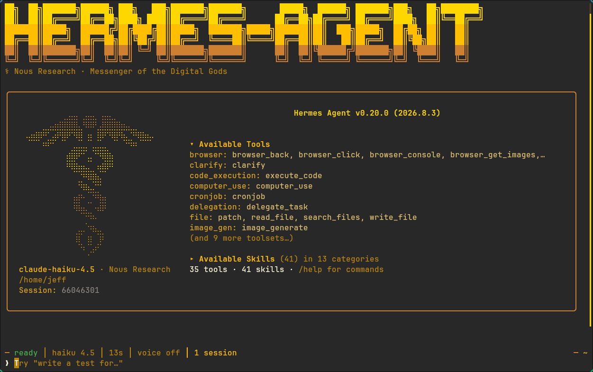
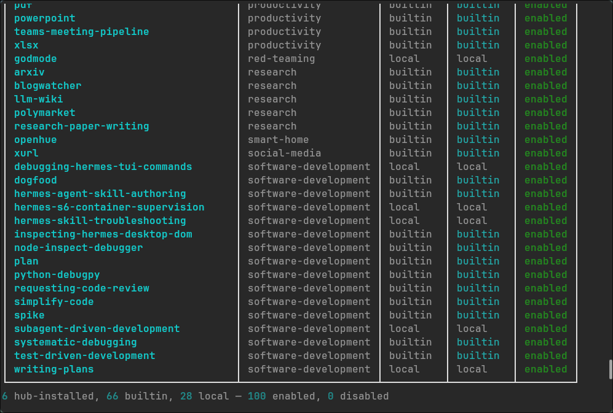

## Background

- I've run Hermes Agent on a dedicated Hetzner VPS since early this year. I got sort of familiar with it to ask its assistance quite frequently on-the-go.
- Whenever I need a new capability, I create my own custom SKILL.md rather than seeking one from Hermes' default shipped catalog. So far I've written about 30 custom skills tailored to my personal usage, demands, and requirements.
- Hermes Agent ships 100+ enabled plugins/skills by default — far too much, and in my opinion a lot of them are **bloatware**. For example, I tried an "excel creator" skill, or similar, whose output quality was completely unacceptable. Some are useless yet keep running whenever the agent launches. This is the main reason I want to clean them all up.

## Steps

### 1. Check what's enabled

```sh
hermes skills list
```

```sh
6 hub-installed, 66 builtin, 28 local — 100 enabled, 0 disabled
```



### 2. Opt out & remove bundled skills

```sh
hermes skills opt-out --remove
```

I had already opted out earlier, so the marker was already present, and the removal of the unmodified bundled skills (66 → 4) still went through:

```sh
Already opted out — marker was already present.

6 hub-installed, 4 builtin, 28 local — 38 enabled, 0 disabled
```


And to show the confirmation message, I ran the same command once more:

```sh
hermes skills opt-out --remove

Opted out of bundled skills. Future install / update / sync runs will not seed bundled skills into this profile.
```

### 3. Revert anytime (optional)

```sh
hermes skills opt-in --sync   # re-seed everything
```

This removes the marker and re-seeds the bundled skills, bringing back the core set if you ever change your mind.
