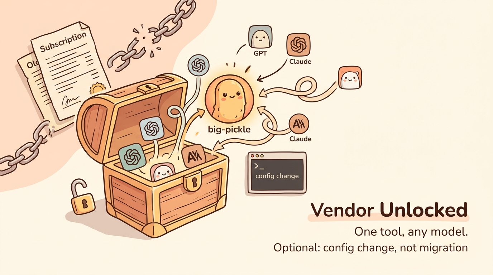
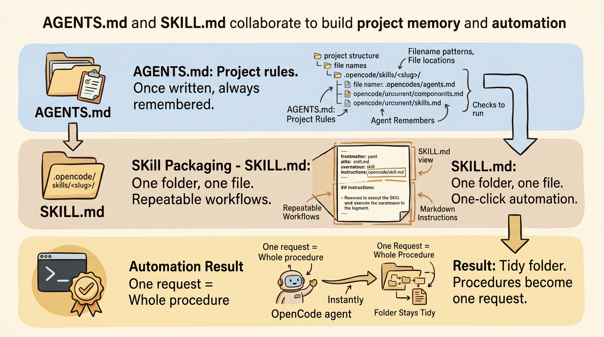
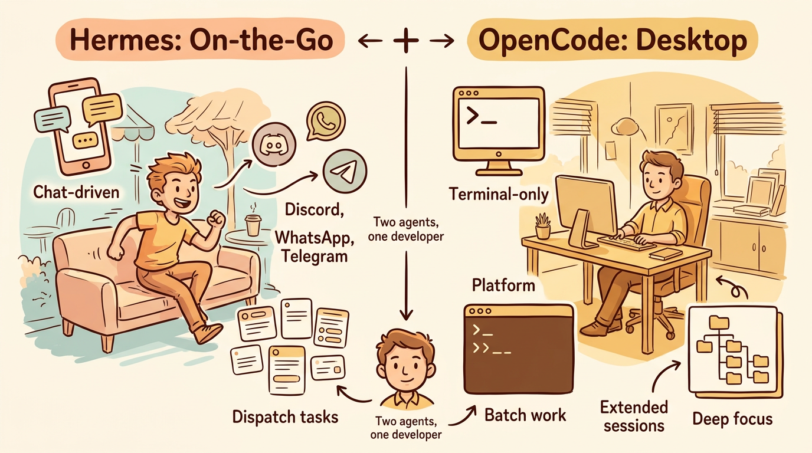

# OpenCode is Best for Me

I've used Codex and Claude in the terminal on my Arch Linux + Hyprland machine, and paid dollars then dollars to Google, Anthropic, OpenAI, Kimi... Then I stopped at **OpenCode** + **OpenRouter** — and I still keep Hermes Agent ⚕, which is another story.

Context (and disclaimer: very personal opinion):
- vi/ vim for quick edits, Cursor only as a markdown editor — I don't use (and don't like) its agent
- **OpenCode** in terminal only

## Vendor Unlocked

The first, obvious one: no lock-in. I want the freedom to get in and out simply — same reason I run open source.

Better still, **OpenCode** becomes a **universal** agent platform — one tool, any model. I'm not married to a provider, and switching models is a config change, not a migration.

## `big-pickle` is Pretty Good

It's the model I default to in **OpenCode**. I use it to manage the look-simple-but-complex logic scattered across more than 10 years of GitHub repos — several hundred documents and code files in Python, Bash, and more. When I tidy up, I honestly don't think I'd finish the cleanup in just a few hours without AI.

It's robust and, best of all, free. Compared to Nvidia Nemotron Ultra (also free), `big-pickle` is consistently fast rather than sometimes quite slow.

## Working with OpenCode: AGENTS.md & SKILL.md

Two things make **OpenCode** feel like it already knows my projects.

- **Keep an AGENTS.md per project** — the must-know file: filename patterns, where files live, what to always check. I create it once and update it as I go, so **OpenCode** remembers the rules instead of me repeating them.
- **Write SKILL.md for OpenCode** — a skill packages a repeatable workflow (steps, rules, examples) that **OpenCode** loads when a task matches. Once it's written, a whole procedure becomes one request.

The side benefit: the folder stays tidy. With other agents (Hermes, OpenAI, Claude...) everyone invents its own pattern and I miss files; with **OpenCode**, the rule sticks.

### SKILL.md for OpenCode

A skill is one folder + one file: `.opencode/skills/<slug>/SKILL.md`. The `SKILL.md` holds a YAML frontmatter on top and the instructions as markdown below — no separate config file needed.

The frontmatter really only needs two fields: **name** (matching the folder, lowercase-hyphenated) and **description** — what it does *and* when to trigger it, because that's all **OpenCode** sees when deciding to load the skill. Optional extras: `license`, `compatibility`, `metadata`.

**OpenCode** finds skills by scanning for `**/SKILL.md` up to the git worktree, and pulls in the full body only when a task matches — so a whole procedure becomes one request.

Full reference: <https://opencode.ai/docs/skills/>

## What I Usually Use OpenCode For

Day to day, **OpenCode** covers three things:

- **GitHub** — managing and cleaning up my scattered repos
- **Writing** — documents and my history/philosophy essays
- **Light scripting** — not-very-complex Python and Bash

## Two Agents I Use Daily

**Hermes** is for on-the-go, where I can talk to and operate my agent through Discord, WhatsApp and Telegram for separate tasks. For most writing or coding, I sit at my desk with **OpenCode** to finish the work.

## Unified Payment with OpenRouter

I used to pay separately at Google, OpenAI and Anthropic and it's a mess — I had to remember to subscribe, add additional credit, or whatever. Can't handle it. I found **OpenRouter.ai** is a good place to hold my credit card and I just monitor the charges from there. When I want a different model, I just **switch models in OpenCode** in seconds — nothing else changes.

## Conclusion

So is **OpenCode** the best? For me, yes — but not because of any single feature. It's the sum of small things: no vendor lock-in, a model I trust for daily work, conventions I can actually enforce, and one wallet to pay. I can swap the model in seconds and nothing breaks. That flexibility is what keeps me here, and I don't see myself leaving any time soon.
