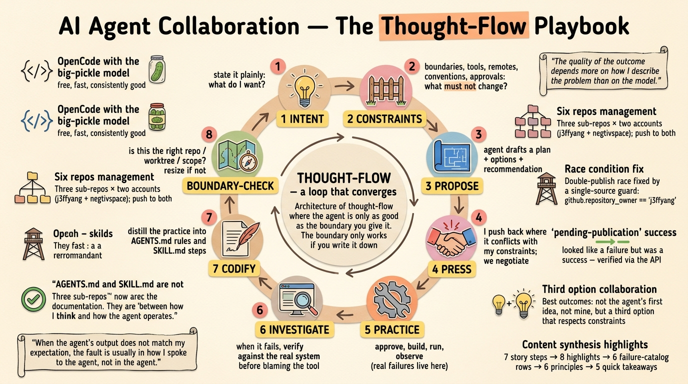

# AI Agent Collaboration: An OpenCode Playbook Built on AGENTS.md and SKILL.md

*How I learned to work with an AI agent — ***OpenCode*** with the `big-pickle` model — through a messy, real multi-repo project, and what that taught me about AGENTS.md, SKILL.md, project boundaries, and the architecture of a thought-flow.*

---



This article is a summary of a project I actually did with an AI agent, plus the lessons that came out of it. It is not a tutorial with a happy, linear path. It is a record of practice — including the mistakes, the disagreements, and the moments where the agent was right and I was wrong, and a few where I was right and the agent was wrong. That honesty matters, because most writing about AI agents shows the polished final state, not the messy process of getting there.

The project: auto-publish `SKILL.md` files from three GitHub repos to **ClawHub**, a skill registry, using GitHub Actions — without installing any CLI tool locally, without converting any existing skills, and without breaking a bilingual publishing pipeline that already worked. It sounds simple. It was not. And that is exactly why it is worth writing down. If you want the compressed version, the Quick takeaways section at the end distills it into five rules.

> **How to read this.** The essay is layered on purpose: the **Steps** are the evidence, the **Highlights** and **Principles** are the reasoning, the **failure catalog** is the reference table, and the **Quick takeaways** are the five rules to actually use. Each layer is a different compression of the same lessons, so you can stop at any depth.

## The setup, in one paragraph

At the time of this project, my skills and articles lived across three sub-repos under a superproject — the set has grown since:

- `history/` — `.opencode/skills/` with two skills (`astro-sync`, `zh-history-literature-culture`)
- `ai-thoughts/` — `.opencode/skills/` with three skills (`astro-sync`, `resize-for-banner`, `translate-to-chn`)
- `ai-custom-skills/` — a bigger matrix of skills under `openclaw/`, `hermes/`, and `claude-code/` roots, plus one awkwardly nested skill

Every sub-repo has **two remotes**: `j3ffyang` (my personal GitHub account) and `negtivspace` (a second personal account). Both are pushed to on every change. Everything is Linux, everything is terminal, everything is minimal.

> **Two accounts, one author.** Both are mine: `j3ffyang` is my primary personal GitHub account; `negtivspace` ("Negative Space 留白") is a second personal account I use to mirror the same repos. Three sub-repos × two accounts is where "six repos" comes from, and pushing to both is why the Step 4 double-publish race existed. And don't confuse `negtivspace` the GitHub account with the `negtivSpace` superproject directory that holds everything.

The goal: when I push a change to a `SKILL.md`, a GitHub Action should detect what changed and publish the new or updated skill to ClawHub under my account — automatically, idempotently, and without me running any local tool.

## The thought-flow: a high-level procedure for how we work together

Here is the part of this essay worth reading first. Over several sessions, a **procedure emerged** for how we share ideas and decide — sometimes with disagreement, mostly in agreement — how and when to generate AGENTS.md and SKILL.md. It is not a rigid process. It is an **architecture of thought-flow**, a loop that converges. Keep it in mind as you read the practice that follows — every step of the story is a working example of one of these stages.

```
┌────────────────────────────────────────────────────────────────┐
│                                                                │
│  1. INTENT         ──  what do I want? state it plainly        │
│          │                                                     │
│  2. CONSTRAINTS    ──  what must not change? boundaries,       │
│                       tools, remotes, conventions, approvals   │
│          │                                                     │
│  3. PROPOSE        ──  agent drafts a plan + options +         │
│                       recommendation                           │
│          │                                                     │
│  4. PRESS          ──  I push back where it conflicts with     │
│                       my constraints; we negotiate             │
│          │                                                     │
│  5. PRACTICE       ──  approve, build, run, observe            │
│                       (real failures live here)                │
│          │                                                     │
│  6. INVESTIGATE    ──  when it fails, verify against the       │
│                       real system before blaming the tool      │
│          │                                                     │
│  7. CODIFY         ──  distill the practice into AGENTS.md     │
│                       rules and SKILL.md steps                 │
│          │                                                     │
│  8. BOUNDARY-CHECK ──  is this the right repo / worktree /     │
│                       scope for this knowledge? resize if not  │
│          │                                                     │
│          └────── loop ── practice again, refine again ──────┘  │
└────────────────────────────────────────────────────────────────┘
```

A few notes on each stage, because the loop only works if the stages are understood:

- **Intent (1) and Constraints (2) are the most expensive stages.** Everything downstream is cheaper. Spending ten minutes stating constraints saves an hour of rework. In this project, the phrase "no local installs" saved me from a whole class of problems, and "push to both remotes" created the collision that "publish from exactly one remote" then fixed.
- **Propose (3) should always include options and a recommendation.** A plan with only one path is a demand, not a proposal. I want to see the tradeoffs so I can disagree meaningfully.
- **Press (4) is not conflict; it is negotiation.** Disagreement is where the constraints I hold meet the system knowledge the agent holds. The `astro-sync` outcome — neither the agent's first idea nor mine — is the template for how I want disagreement to end.
- **Practice (5) is where the loop is honest.** No plan survives contact with a real registry, real secrets, and two GitHub accounts. The failures at this stage are the ones that teach.
- **Investigate (6) is the discipline that separates debugging from guessing.** Read the source. Hit the API. Verify the claim against the live system. This is what turned "the workflow is broken" into "the workflow has a race I designed."
- **Codify (7) is the payoff.** The moment a procedure works twice, it becomes a candidate for a SKILL.md. The moment a rule is true for a whole repo, it becomes an AGENTS.md entry.
- **Boundary-check (8) is the meta-skill.** Ask: does this knowledge belong at the parent level, at the sub-repo level, or nowhere? Too broad, and it dilutes. Too narrow, and it fragments. The worktree is my natural unit for AGENTS.md; the recurring procedure is my natural unit for SKILL.md.

## What actually happened, step by step

### Step 1 — the plan was approved, the boundary was set

The very first thing the agent did was not code. It was asking me to define the boundary: which repos, which remotes, which skills, which constraints. I said: publish skills from the three sub-repos, do not change any skill content, do not install anything locally, and push to both remotes as the repo rules require.

Here is the first lesson, and I will say it plainly:

> **The quality of the outcome depends more on how I describe the problem than on the model.**

### Step 2 — the reusable workflow was pinned, and the first wall appeared

ClawHub ships an official reusable GitHub Action: `openclaw/clawhub/.github/workflows/skill-publish.yml`. The obvious choice was to reference it with `@v1`. The agent checked and found that **`@v1` does not exist** — the latest tag at the time was `@v0.23.3`. So we pinned to that.

The first run failed immediately with a `startup_failure`:

```
The nested job 'publish' is requesting 'id-token: write', but is only allowed 'id-token: none'
```

This is a GitHub Actions quirk: a caller job that invokes a reusable workflow must declare `permissions: { contents: read, id-token: write }` **at the job level**, or the reusable workflow's own OIDC token request is denied. It is the kind of error that is meaningless until you have hit it once, and instantly recognizable forever after.

Fix one: add the job-level permission. Push. Watch it run further.

### Step 3 — the secrets, and the two-account puzzle

The publish needs a token. I have one account on ClawHub: `j3ffyang`. The agent proposed setting a `clawhub_token` repository secret on all six repos (three sub-repos × two remotes). That was the first moment of real friction: **secrets could not be set on the `negtivspace` copies of two of the repos.**

Why? Because `negtivspace` is a **user account**, not an organization. A user account's repo only lets the owner set secrets, and the owner is the account itself — my other account (`j3ffyang`) could not set secrets there without write access. GitHub's secret API needs the caller to have write permission on the repository, and collaborator-level access was not granted.

The fix was a small but real collaboration change: I granted the `j3ffyang` account **Write** collaborator access on `negtivspace/ai-custom-skills` and `negtivspace/ai-thoughts`. Then the secrets went in.

### Step 4 — the runs ran. And failed. For two very different reasons.

Now the workflows actually executed. The logs showed failures, but the failures split into two families, and telling them apart was the entire game:

**Family A — `Version X.Y.Z already exists. Increment the version number and try again.`**

`astro-sync` (in both `history` and `ai-thoughts`), `zh-history-literature-culture` (`history`), and `blog-image-enricher`, `indepth-perspective`, `image-to-video-gen` (`ai-custom-skills`) all failed with this. I assumed the workflow was broken. The agent was not so sure, and dug into the ClawHub CLI source (`/tmp/opencode/publish-v0233.ts`) to read how version resolution actually works.

The root cause was beautiful and infuriating at the same time: **both remotes of every sub-repo run the same workflow, and both publish to the same ClawHub account.** `j3ffyang/history` and `negtivspace/history` were racing to publish `astro-sync` at the same time. Whoever landed first created `1.0.0`; the other got "Version 1.0.0 already exists." It was not a bug in my workflow at all. It was a **double-publish race** I had designed into the system by pushing to two remotes.

The agent did not just assert this. It queried the ClawHub API with the token and showed me the actual records: every "collided" version existed on ClawHub under `j3ffyang`, with timestamps in the exact window the workflows ran. That is the practice I value most now: **when something looks broken, verify against the real system before assuming the tool is wrong.**

**Family B — `Invalid publish output: 'pending-publication'`**

This one looked like a real error too. The agent read the upstream reusable workflow's Python, and found the truth: the workflow's status map only recognizes `would-publish`, `published`, and `unchanged`. The ClawHub CLI, when a publish is submitted and awaiting an async security scan, returns `pending-publication` — which the upstream workflow does not map, so it throws, and reports the skill as *failed*.

But the skill **did** publish. The API confirmed `blog-polish-zhcn@1.0.14`, `resize-for-banner@1.0.0`, and the rest were all live on ClawHub. The "failure" was a **cosmetic upstream status-mapping bug** — a false alarm baked into the third-party workflow, not my system.

### Step 5 — the real fix: one source publishes

The fix for Family A was one condition, added to both jobs in all three workflow files:

```yaml
if: github.event_name != 'pull_request' && github.repository_owner == 'j3ffyang'
```

`github.repository_owner` resolves at runtime from whichever repo runs the workflow. On `j3ffyang/*`, the owner matches, and the publish job runs. On `negtivspace/*`, the owner is `negtivspace`, the condition is false, and the job is skipped. The `negtivspace` copies keep the file — the mirrors stay in sync — but they become a **no-op by design**. One source publishes. The race is gone. Every run after that was green. This is the single most important engineering decision in the whole project, and it came from a small conversation: I described the symptom ("collisions"), the agent traced it to the design (two remotes), and I agreed to the fix (a guard) rather than trying to make both remotes coexist. The rule now lives in a skill, documented so neither of us forgets it.

### Step 6 — the slug collision, and a disagreement that ended in a good compromise

With the race fixed, a quieter problem surfaced. Both `history/.opencode/skills/astro-sync` and `ai-thoughts/.opencode/skills/astro-sync` exist. They have the **same slug but different content** — the `ai-thoughts` version had been adapted (different source paths, no fact-checking step, a `featured` parameter). ClawHub treats slugs as unique per owner, so the two copies were **overwriting each other on every publish.** `ai-thoughts` had just published `astro-sync@1.0.1`, clobbering `history`'s `1.0.0`.

The agent proposed deleting or renaming `history`'s copy. I pushed back: **I still need `astro-sync` in the `history` project.** It is the skill that publishes history articles to my blog; removing it would break my own workflow.

Here is where the agent did something right: it did not argue, and it did not just agree. It checked how **OpenCode** discovers skills (walks up from the current directory to the git worktree root, loading `.opencode/skills`, `.claude/skills`, and `.agents/skills`), and it proposed a compromise I had not thought of:

- Keep `history`'s `astro-sync` exactly where it is — local, authentic, loadable in the `history` project.
- Stop publishing it by switching `history`'s workflow from `root: .opencode/skills` to a `skill_path` that names only `zh-history-literature-culture`.
- Let `ai-thoughts` remain the sole *published* `astro-sync`.

Nothing was lost. The local skill stayed authentic, the registry stopped getting clobbered, and my blog workflow kept working. That is the kind of outcome I want from a collaboration: **not the agent's first idea, and not mine, but a third option that respects the real constraints.**

### Step 7 — codifying what we learned

The last step was turning the messy process into durable knowledge. We created a skill, `.opencode/skills/clawhub-publish/SKILL.md`, that documents the whole pipeline: the single-source rule, the owner guard, the version semantics, the `pending-publication` false alarm, the slug-collision policy, and how to verify a publish with the ClawHub API. Our first instinct was to put it at the parent level — but a session opened inside a sub-repo cannot see a parent-level skill, so it landed in `ai-thoughts/.opencode/skills/`, where the publishing work actually happens. The workflow files were committed to both remotes, submodule pointers were bumped, and every `j3ffyang` run went green.

The whole journey took a few sessions. Nothing in it was a single brilliant move. It was a loop of *intent → constraints → propose → press → practice → investigate → codify → boundary-check*, run enough times that the system became boring and reliable.

## The highlights — what I actually learned

Now the part I want to keep. These are the highlights, each one earned by practice — and each one reappears, compressed, in the failure catalog below.

### 1. OpenCode with the `big-pickle` model is powerful — and surprisingly free

I run **OpenCode** in the terminal, on Arch Linux. My default model is **`big-pickle`** — free, fast, and consistently good. This combination does not ask for a subscription, and it does not throttle me into uselessness. The `big-pickle` model handled a multi-repo, multi-account, external-registry automation project without drama: it read the upstream workflow source, queried the live API to verify hypotheses, and reasoned about GitHub Actions permission quirks it had clearly seen before.

### 2. It can do far more than I imagined — if I let it

The moment that changed my attitude was in Step 4, when the agent said, in effect: "let me read the ClawHub CLI source to understand how version resolution works." I had assumed the collisions were a config error; the agent went a level deeper, downloaded the source, and read the actual resolution logic. That is not pattern-matching — it is investigation, and it is the point: a good agent with the right tools (bash, web fetch, file reads, git) can do genuine debugging across a system I had no visibility into. My imagination was the limit, not the model.

### 3. When the result is not what I expected, it is usually me

I want to be blunt about this, because it is the most useful lesson and the least comfortable one:

> **When the agent's output does not match my expectation, the fault is usually in how I spoke to the agent, not in the agent.**

Every frustrating failure in this project traced back to something I had not said clearly:

- I said "publish skills to ClawHub" but did not say "publish from exactly one remote" — and designed a double-publish race.
- I did not specify the boundary between published and local-only skills — and created a slug collision.
- I approved a plan without noticing it would rename or move a skill I still used locally.

The moments where I got the outcome I wanted were the moments where my instruction was precise: single-source, no content changes, no local installs, push to both remotes. Precision in, precision out. Vagueness in, guesswork out.

This is not to let the agent off the hook — it made real mistakes too, and I overrode it when I had context it lacked. But the honest accounting is that **most of the misses were mine**, and most of them were communication misses.

### 4. AGENTS.md and SKILL.md are the real technology

Here is the claim I care most about:

> **AGENTS.md and SKILL.md are not documentation. They are the interface between how I think and how the agent operates.**

- **AGENTS.md** is the constitution of a repo: what it is for, how files are named, what must always be checked, what the working rules are. It is how I make the agent remember my conventions instead of me repeating them every session.
- **SKILL.md** is a packaged procedure: a repeatable workflow with steps, rules, and error handling that loads when a task matches. Once it is written, a whole multi-step process becomes a single request.

In this project, the AGENTS.md files did real work. The `history/AGENTS.md` tells the agent that every change needs approval, that facts need two sources, that filenames follow `YYMMDD-slug`. The parent `negtivSpace/AGENTS.md` tells it to push to both remotes and how the profile README sync works. Without them, the agent would have asked me the same questions every session, and the answers would have drifted.

The skills did real work too. `astro-sync` turned a long editorial procedure into one request. `clawhub-publish` turned a hard-won debugging session into a checklist the agent can follow next time. The effort is front-loaded — but the payoff compounds, because the knowledge survives the session.

### 5. Project boundary: too big is vague, too small is unmanageable

The most subtle lesson was about **where a skill or an AGENTS.md should live**.

I discovered, by practice, that **OpenCode** discovers skills by walking up from the current directory **until it reaches the git worktree root**, and it does not cross into the parent superproject. Proof: I created `.opencode/skills/clawhub-publish/` in the parent repo, and a session opened inside `history/` could not see it at all. The skill was invisible precisely because `history/` is its own git worktree.

This is the boundary problem in miniature:

- **Too big a scope** — one giant AGENTS.md for everything under one superproject — means every instruction is watered down to apply to all repos, so none of them gets specific, accurate rules. Vague instructions produce vague behavior.
- **Too small a scope** — an AGENTS.md and skill per trivial folder — means I drown in files to maintain, and the same knowledge gets duplicated and then drifts.

The sweet spot I settled on: an AGENTS.md per git worktree (each sub-repo gets its own, plus one for the parent), and a SKILL.md only for procedures I actually run more than once. The `astro-sync` collision taught me the boundary the hard way: the skill had to be *local to the project that uses it* and *published from only one repo*. Same skill, two concerns, one boundary each.

### 6. Let the AI recommend — but do not agree all the time

I want to keep this short because it matters: the agent recommended placing `clawhub-publish` at the parent level, and I initially accepted — only to unwind it once we found a session inside a sub-repo cannot see a parent-level skill. It also gave me a recommendation I rejected (moving `history`'s `astro-sync` to `.claude/skills/`, which I refused because the skill was written for **OpenCode**, not Claude) and a recommendation I eventually loved (the `skill_path` compromise).

The skill is not in following every recommendation, and not in ignoring them all. The skill is in **treating the agent's proposal as the first draft of a decision, not the decision itself.** I hold the constraints (the `history` project still needs `astro-sync`; the skill must stay authentic; nothing gets installed locally; both remotes get pushed). The agent holds the system knowledge (how **OpenCode** loads skills, how ClawHub resolves versions, how the workflow maps statuses). The best decisions came from me stating the constraints and letting the agent find a path through them — then checking the path against my constraints before accepting it.

### 7. Write your wants into AGENTS.md

One small but effective habit: **write the operating preferences directly into AGENTS.md so the agent never has to ask.**

In my case:

```
- minimalist, Linux only, prefer command line
- no local installs unless approved
- get approval before any change
- commit only when asked; stage only intended files
```

These are not technical instructions. They are *character*. And they change the behavior of every session. The agent does not propose GUI tools, does not install things without asking, does not barrel ahead on edits, and stages only what I told it to. That last one saved me repeatedly: when the parent repo had modified submodule pointers and an untracked folder I did not want touched, the rule "stage only intended files" meant the commit contained exactly the SKILL.md and nothing else.

### 8. I love OpenCode in the terminal

I will say the obvious thing plainly: I love this tool in the terminal. The TUI is where I live — fast, keyboard-driven, no tab-switching to a web app. It runs on my Linux box, it respects my constraints, it reads my AGENTS.md files, and it keeps my workflow in git. The `Tab` key toggles plan/build mode, which is how this whole project worked: plan, approve, build, verify, repeat. It feels less like "using a product" and more like "hiring a very fast, very literal colleague who remembers everything I write down."

Part of the appeal is that the terminal **shows its work.** Every message the agent produces is printed out in front of me — the tool calls it runs, the reasoning it goes through, the thought flow and the logic it followed. I can watch the AI think, not just read its conclusions. And because I live on Linux, the error messages are mostly native system errors — `No such file or directory`, `error: failed to push some refs`, `startup_failure`, exit codes — which make instant sense to me. When something fails, I can see *exactly* what happened, no translation layer, no friendly-but-vague wrapper hiding the cause. To me, that transparency is the whole difference between trusting a tool and merely using it.

## The failure catalog — the raw material of the playbook

Everything above was distilled from concrete failures. It is worth keeping them as a catalog, because each one maps to a lesson and a rule I now enforce:

| Failure | What I first thought | What it actually was | Fix | Lesson |
| --- | --- | --- | --- | --- |
| `startup_failure`: "requesting 'id-token: write', but is only allowed 'id-token: none'" | The workflow file was wrong | Reusable-workflow callers must declare job-level `permissions: { contents: read, id-token: write }` | Added the job-level permission | Platform quirks look like config errors; read the exact error text |
| `Version X.Y.Z already exists` on several skills | The registry was broken | Both remotes raced to publish the same slug to the same account | `github.repository_owner == 'j3ffyang'` guard makes `negtivspace` copies a no-op | I designed a double-publish by pushing to two remotes; single source publishes |
| `Invalid publish output: 'pending-publication'` | The publish failed | The CLI's `pending-publication` status (async security scan) is unmapped in the upstream workflow; the skill actually published | None needed — verify with the API, treat as success | Don't trust the wrapper's status map; check the real system |
| `astro-sync` overwriting itself | Two repos shared a slug harmlessly | ClawHub slugs are unique per owner; two different copies clobbered each other | `ai-thoughts` stays published; `history`'s copy kept local via `skill_path` | Same name is not the same thing; boundary every skill |
| Skill invisible in a sub-repo | I forgot to commit it | **OpenCode** loads skills only up to the git worktree root; a parent-level skill is invisible inside a submodule | Placed the skill in the repo that actually uses it | The discovery rule is the boundary rule |
| Secret could not be set on `negtivspace` repos | The CLI was failing | `negtivspace` is a user account; only the owner (or a Write collaborator) can set secrets | Granted Write to `j3ffyang` on the two repos | Two accounts means two permission models |

The pattern across every row is the same: **an error message is a clue, not a conclusion.** The discipline that unblocked every row was the same too — investigate against the real system (read the upstream source, call the API, check the token's identity) before changing anything.

## What this looks like as conventions

To make the playbook concrete, here is the shape of the AGENTS.md and SKILL.md files that emerged. Not as templates to copy — as evidence of the pattern.

A minimal AGENTS.md for a content repo looked like this:

```markdown
# AGENTS.md

## Project
Bilingual repository of articles on <topic>. Written in <language>.

## Working rules
- Get approval before any change. Present the plan and wait for the go-ahead.
- Commit only when asked; stage only intended files.
- Linux only; prefer command line; minimalist.

## Filename conventions
- docs/<YYMMDD>-<slug>.md — 6-digit date, hyphen, lowercase slug. No spaces.
- imgs/<YYMMDD>-<slug>.<ext> — images share the article's date prefix.

## Repository layout
- docs/ — articles; imgs/ — images; README.md — index (hand-edited).
```

Three sections. That was enough. Everything else — the profile sync, the two remotes, the publishing rules — lived either in the file that needed it or in a SKILL.md.

A SKILL.md for a repeated procedure had this shape:

```markdown
---
name: clawhub-publish
description: Publish SKILL.md files to ClawHub and diagnose publish failures.
---

# ClawHub Skill Publish

## Single-source rule — read before anything else
- Only the j3ffyang/* copies publish. negtivspace/* copies are no-ops by design.

## Pipeline
- Workflow per repo calls the reusable workflow, pinned to a specific tag.

## Status & version semantics
- unchanged → nothing to do; new → 1.0.0; changed → next patch.
- 'pending-publication' → actually succeeded; verify with the API.

## Procedure
1. Add/edit a skill in the correct root.
2. Push to both remotes; the j3ffyang copy publishes.
3. Wait for the run; check the summary for the slug.
4. Verify on ClawHub with the API; check the latestVersion and owner.

## Error Handling
- Version already exists → already published; next run marks it synced.
- Slug collision → only one repo publishes a given slug.
```

The details differ per project. The shape does not: **rules at the top that must not be skipped, the pipeline as a map, status semantics so a false alarm is not treated as a breakage, and a procedure short enough to follow.**

## Principles, stated plainly

The method I ended up with is personal. I do not claim it is the right way, or the only way. There is no 100% right and wrong in this territory — no black and white. What I can say is that the approach worked for me, and that it is built on a few principles I keep returning to:

1. **Precision in, precision out.** The quality of the agent's work tracks the quality of my description. Vague intent produces guesswork; precise constraints produce exactly the automation I wanted.
2. **The boundary is the work.** Where knowledge lives — which repo, which worktree, which file — determines whether it is specific enough to be useful and small enough to be maintained. Getting the boundary wrong was the source of my two hardest failures.
3. **Verify before blaming.** When the result is wrong, check the real system first — the failure catalog above is the same lesson in six rows. The version collisions looked like my bug and were my design; `pending-publication` looked like a failure and was a success. Neither was what it seemed.
4. **Codify what works.** A lesson that is not written down is a lesson that will be paid for again. AGENTS.md and SKILL.md are how I make the agent stop relearning what I already know.
5. **The agent is a colleague, not an oracle.** It recommends; I decide. Its proposals are drafts for me to check against my constraints. The best decisions came from that friction.
6. **The right model matters, but so does the orchestration.** `big-pickle` is free and excellent, but it succeeded here because of the loop — propose, practice, investigate, codify — not because of the model alone. Orchestration and operation of the agent, wrapped in good conventions, is the real multiplier.

## Quick takeaways

If you remember only five things from this essay:

1. **Think architecturally and logically.** Before writing any code, draw the whole flow in your head — the repos, the remotes, the account that publishes, the failure modes. Almost every bug in this project was a design flaw I had not thought through, not a syntax error.

2. **Use GitHub's own tooling via `gh` to automate.** A lot of what you want already exists as a CLI command: `gh run watch`, `gh run view --log`, `gh api repos/<owner>/<repo>/actions/runs` return run history, logs, and any field as JSON. Tell **OpenCode** "use `gh`" and a click-around-the-UI task becomes a scriptable command the agent can run and parse.

3. **Make the API the primary way to verify.** Tell **OpenCode** explicitly: "use the API" or "choose the API as the primary option." The registry's own report was wrong (`pending-publication` was a success); the API was right. `curl` the live endpoint and check the record before trusting a status message.

4. **Codify when the job is done.** Once a task works, package the procedure into a custom `SKILL.md` so it becomes a one-request repeatable step. If the change is a rule that should hold across projects — naming, remotes, approvals — put it in `AGENTS.md` instead. Skill for the procedure, AGENTS.md for the constitution.

5. **Let the agent fix — but read what it asks to run.** I let it execute freely, but only after it asks for approval for every shell or Python command. I may not fully understand a long script — at minimum I read its summary of what it is about to do, and when I am not sure, I suspend the run and ask it to elaborate before I decide.

## Closing

I started this project wanting to auto-publish skills. I ended up with a small, reliable pipeline, a set of conventions that make the next project faster, and a much clearer idea of how to work with an AI agent at all. The pipeline itself is almost boring now — which is exactly what I wanted. The interesting part is the loop that produced it.

The practice that made it work was writing down what I know — in AGENTS.md for the rules, in SKILL.md for the procedures, and now in this essay for the thinking.

If you take one thing from this, let it be this: **the agent is only as good as the boundary you give it, and the boundary only works if you write it down.** Everything else is just practice.

btw, i use arch 
