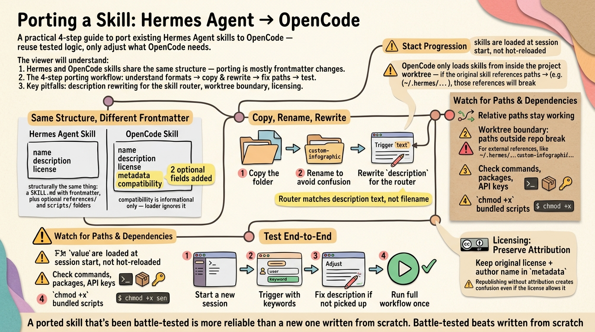

Besides writing a skill from scratch, you can port an existing one. Porting reuses tested, battle-hardened logic — you keep the body and only adjust what OpenCode needs. The `custom-infographic` skill in this repo (`.opencode/skills/custom-infographic/`, formerly `baoyu-infographic`) is a working example, ported from [JimLiu/baoyu-skills](https://github.com/JimLiu/baoyu-skills) v1.56.1 via Hermes Agent ⚕.

## 1. Understand the two formats

A Hermes Agent ⚕ skill and an OpenCode skill are structurally the same thing: a `SKILL.md` with frontmatter, plus optional `references/` and `scripts/` folders next to it. The layout is identical, so porting is mostly frontmatter + a quick test.

What differs is the frontmatter. A Hermes ⚕ skill typically has:

```yaml
---
name: some-skill
description: What it does
license: MIT
---
```

OpenCode uses the same `name`, `description`, and `license` fields. Two optional additions: `metadata` (credits the original author, useful for publishing) and `compatibility` (informational — OpenCode's loader ignores it, but it documents the skill's target platform):

```yaml
---
name: some-skill
description: A trigger-friendly description with keywords like "信息图", "visual summary", or "generate a poster"
license: MIT
compatibility: opencode
metadata:
  author: Original Author
  upstream: https://github.com/author/some-skill
  version: 1.0.0
---
```

## 2. Copy the skill and rewrite the frontmatter

1. Copy the skill folder into `.opencode/skills/` (project) or `~/.config/opencode/skills/` (user-global): `cp -r ~/.hermes/skills/some-skill .opencode/skills/`
2. Rename the skill folder to avoid confusion with the original — e.g. `baoyu-infographic` became `custom-infographic`. The `name` field in frontmatter follows the folder name. Keep the original author name in the `metadata` block as a sign of respect.
3. Keep `description` and `license` from the original.
4. Add `compatibility: opencode` (optional, informational — OpenCode ignores it but it documents the skill's target platform).
5. Rewrite `description` so OpenCode's skill router triggers on it: include the action verbs and keywords a user would type, in English and Chinese if relevant. The router matches this text, not the filename — a vague description means the skill never gets picked up.
6. Add a `metadata` block crediting the original author and the upstream repo — good practice for attribution. OpenCode's loader ignores it, but it's useful for humans browsing skill folders and for publishing to ClawHub.

## 3. Fix paths and dependencies

The body rarely needs changes; paths and environment do.

- `references/` and `scripts/` live beside `SKILL.md` — relative references (e.g. `references/layouts/bento-grid.md`) keep working as long as you copy the whole folder, not just the file. Note that OpenCode only loads skills from inside the project worktree — if the original skill references paths outside the repo (e.g. `~/.hermes/...`), those references will break.
- Check hard-coded paths: a Hermes ⚕ skill may assume `~/.hermes/...` or its own skill dir; OpenCode skills run from the project, so prefer relative paths or env vars.
- Check external dependencies: commands (`which python3`), Python packages, or API keys. The `custom-infographic` port needs `OPENROUTER_API_KEY` for image generation — set it in the environment or document it in the SKILL.md.
- `chmod +x` any bundled scripts.

## 4. Test it in OpenCode

1. Start a new OpenCode session so it picks up the new skill (skills are loaded at session start, not hot-reloaded).
2. Ask for the skill's job using its trigger words (e.g. "make an infographic about X").
3. If it isn't triggered, tighten the `description` — the router matches that text.
4. Run the skill's own workflow end to end once, and fix whatever the error output reveals.

That's it — porting is faster than writing from scratch, and it keeps the original author's tested behavior intact. The `custom-infographic` port has been tested many times and works consistently, with output proof in `imgs/` — a ported skill that's been battle-tested is more reliable than a new one written from scratch.

A note on licensing: porting an MIT-licensed skill is fine as long as you preserve the original license and author attribution. If you plan to publish the port to ClawHub, keep the original author's name in the `metadata` block — republishing without attribution creates confusion even if the license allows it.

btw, i use arch
