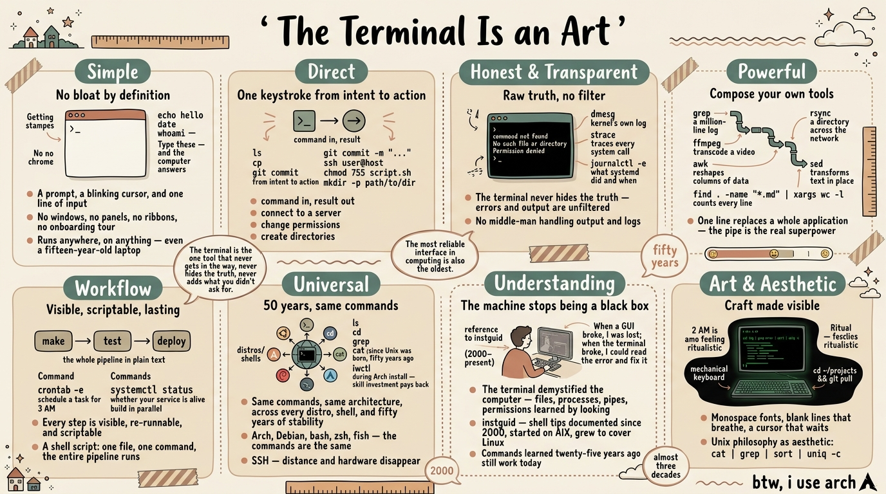

I've been using Unix and Linux for almost thirty years now, and I still spend most of my day inside a terminal. Not because I have to — because it's the closest thing to an art form this industry ever produced. Every year the desktop gets shinier, the apps get bigger, and I keep coming back to a blinking cursor and a prompt. Here's why.

## Simple

A terminal is the simplest thing there is: a prompt, a blinking cursor, and one line of input. No windows, no panels, no ribbons, no onboarding tour. Strip away the chrome and you're left with the pure act of telling a computer what to do. I am a minimalist, and I hate bloatware — the terminal starts from almost nothing and grows only with what you add. It runs anywhere, on anything: a fifteen-year-old laptop with no desktop environment becomes usable the moment it has a shell. The terminal doesn't care about your hardware, your RAM, your GPU — it asks for almost nothing and gives you everything. What you see is the essentials done perfectly — no feature bloat, no cruft, just the parts that matter.

Type `echo hello`, `date`, `whoami` — and the computer answers. No setup, no configuration, no tutorial needed.

## Direct

You say what you want, and it happens. `ls`, `cp`, `git commit -m "..."` — command in, result out. Need to connect to a server? `ssh user@host`. Need to change permissions? `chmod 755 script.sh`. Want a directory and all its parents? `mkdir -p path/to/dir`. No menus to navigate, no settings to hunt for — just you and the machine, speaking the same language. The gap between wanting and doing is one keystroke. That directness is why I can work faster in a shell than in any application I've ever used.

## Honest and Transparent

The terminal throws errors straight in your face. `command not found`. `No such file or directory`. `Permission denied`. It tells you exactly what went wrong, right here, right now — no polite wrapper, no vague apology. That honesty is the thing most missing from modern software. A GUI often swallows the reason and shows you a spinner; the terminal never does. And because every command is right there in front of you, nothing is hidden — what you ran is what happened, and you can run it again and watch it happen again. It's the most transparent interface I know.

And there's no middle-man handling your output and logs — including errors. What you see is exactly what the system produced, unfiltered by any layer of abstraction. And when you need to dig deeper, the tools are there: `dmesg` shows you the kernel's own log, `strace` traces every system call a process makes, `journalctl -e` shows you exactly what systemd did and when. No GUI offers that level of honesty — the terminal hands you the raw truth and trusts you to read it.

## Powerful

One line replaces a whole application. `grep` a million-line log. `rsync` a directory across the network. `ffmpeg` transcode a video with more options than any GUI could fit in a menu. `awk` reshapes columns of data. `sed` transforms text in place. `find . -name "*.md" | xargs wc -l` counts every line in every markdown file in your tree. The pipe is the real superpower — chain `cat`, `sort`, `uniq -c`, and `head` together and you've built an analytics tool that no vendor ships. The power isn't in fancy buttons — it's in the words you type. The terminal scales with your imagination, not with the version number.

## The Workflow Is Right in Front of You

The terminal makes work visible. Every step you take is a line you can see, read, and re-run. `make`, `test`, `deploy` — the whole pipeline is laid out in plain text, and when something fails, you see exactly where. `crontab -e` schedules a task for 3 AM. `systemctl status` tells you whether your service is alive. `make -j4` builds your project in parallel. A shell script ties it all together — one file, one command, the entire pipeline runs. Better still, that workflow becomes a script: a file that replays your steps perfectly, every time, on any machine. A GUI workflow lives in your muscle memory and dies with your patience; a terminal workflow lives in a file and lasts forever.

## Universal

It doesn't matter what distro you run — Arch, Debian, whatever. It doesn't matter what shell — bash, zsh, fish. It doesn't matter what terminal emulator or desktop — KDE, GNOME, kitty, terminator, or a bare TTY on Hyprland. The commands are the same, because the machine underneath is the same: the same tools, the same commands, the same pipe-and-filter architecture, regardless of who packaged them. And as long as you have a shell — even one on a server on the other side of the planet, reached through SSH, the secure shell — you can run it. Distance and hardware disappear; it's just you and a prompt, same as always.

And the commands themselves often come from the same repo maintainer — tools built together, designed to work together, all speaking the same language. These aren't tools that change every few years. `ls`, `cd`, `grep`, `cat` — they've been there since Unix was born, fifty years ago. A command I type today would work on a system from 1975. There's something profound about that stability: the most reliable interface in computing is also the oldest. Technologies come and go, GUIs get redesigned every couple of years, and the terminal quietly outlasts them all.

When I installed Arch, I connected to Wi-Fi using `iwctl` in a text UI — no network manager, no GUI. Everything seemed difficult at first, but the commands haven't changed in half a century. That skill investment pays back every day.

And the terminal needs almost nothing around it. Log into a remote machine through SSH and you have everything — no VPN client, no middle-man app, no Tailscale tunnel. The terminal *is* the network layer.

The same goes for editing. I live in vim — almost never gvim, never a graphical IDE. A terminal and vim give me everything I need: editing, split windows, a shell, `git`, even a Python IDE through plugins. No VS Code, no Cursor, no Electron wrapper eating four gigs of RAM. The terminal doesn't need dependencies. It's the dependency everything else builds on. The only times I reach for a graphical editor are rendering markdown previews and PlantUML diagrams — things the terminal can't yet show inline. Everything else stays in the shell.

## The Terminal and the Agent

And now the terminal has a new partner: the AI agent. An agent needs to read output, run commands, see results, and iterate — that's the shell. No GUI needed, no API wrapper, no custom integration. The agent types into a prompt just like I do, and the machine answers just like it always has. The terminal was built for this kind of collaboration — two minds, one prompt, taking turns.

Compare that to an AI agent in a browser or a dedicated desktop app. The browser agent is sandboxed — it can only do what the browser allows, limited to web pages and APIs someone else designed. The desktop app wraps the agent in a proprietary interface you can't inspect or extend. Both constrain what the agent can do. The terminal agent has full access to the system — the same filesystem, the same shell, the same commands you use. It works in your environment, not a walled garden. And when it's done, you can take over with the same tools. That capability and control is why I trust a terminal agent more than any GUI wrapper.

And the terminal keeps surprising me in both directions. Modern terminal emulators — kitty, wezterm, others — accept images dragged right into the window. Drop a screenshot, a chart, a photo, and it appears inline or lands as a path you can work with. The tool that was "just text" for fifty years now handles images without becoming something else. It didn't add a media panel or an upload dialog. It stayed itself and grew. The same is true of the agent — the terminal didn't need a redesign to host AI. The prompt was already the perfect interface. That's what the best tools do.

## It Made Me Understand How Things Work

This is the deepest gift, and maybe the real reason I've stayed for almost thirty years. Because the terminal is simple, honest, and transparent, it demystified the computer for me. Files, processes, pipes, permissions — I learned them by looking, not by clicking through menus. When a GUI broke, I was lost; when the terminal broke, I could read the error and fix it. The machine stopped being a black box. I understand my systems in a way GUI usage alone never teaches, and that understanding came free, from the tool itself. I've kept running notes since 2000 ([instguid](https://github.com/j3ffyang/instguid)), a living reference that grew from AIX to cover Linux, networking, and security.

## The Art and Aesthetic

People call the terminal ugly — and from the standpoint of decoration, they're right. But decoration isn't art. Its beauty is the beauty of negative space — monospace fonts where every character takes the same width, blank lines that breathe, a cursor that waits without demanding.

Art isn't always about decoration — sometimes it's about craft. The terminal is the one tool that never gets in the way, never hides the truth, never adds what you didn't ask for. The Unix philosophy — do one thing and do it well — isn't just an engineering principle. It's an aesthetic one. A pipe chain like `cat log | grep error | sort | uniq -c` is a small composition: honest pieces combined into something greater than any one of them. And there's a ritual to it: the sound of a mechanical keyboard, the rhythm of `cd ~/projects && git pull`, the green-on-black glow at 2 AM. The terminal has a feel — physical, almost musical — that no GUI replicates. Simple, direct, honest, powerful, universal, and still growing — built once, fifty years ago, and still the best way to talk to a computer. I still think of the command line not as a tool but as a craft — and that's the closest thing to art I know.

## Commands in This Essay

**Getting started:** `echo`, `date`, `whoami`
**File & directory:** `ls`, `cp`, `mv`, `mkdir -p`, `chmod`, `touch`
**Search & text:** `grep`, `awk`, `sed`, `find`, `xargs`, `sort`, `uniq`, `cut`, `head`, `wc`
**Networking:** `ssh`, `wget`, `rsync`, `iwctl`
**System:** `dmesg`, `strace`, `journalctl`, `systemctl`, `crontab`, `make`, `ps`
**Media:** `ffmpeg`
**Version control:** `git`

btw, i use arch 
