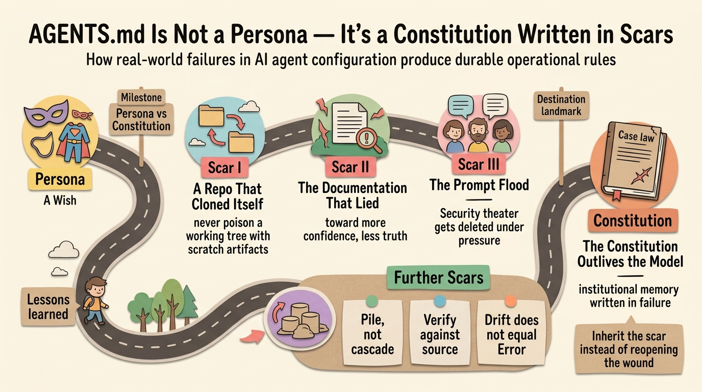

Ask around and you'll find most people treat their agent's instruction file as a costume. "You are a senior developer." "Act as a university history professor." Persona prompts have their place, but after months of living with a real `AGENTS.md` — editing documents, writing code, and cleaning up after real failures — I've concluded the persona is the least interesting part of the file. The valuable content is the other kind: operational law. Rules that were not imagined but *earned*, each one traceable to a specific incident where something went wrong and never should again.

A persona claims what an agent is. A constitution constrains what it may do. The first is a wish; the second is case law. This article is about the second — told through the actual scars, from an agent-agnostic point of view. Whether your tool reads `AGENTS.md`, `CLAUDE.md`, `.cursorrules`, or a `SOUL.md`, and whether your gates live in `opencode.jsonc`, `settings.json`, or an MCP config, the mechanism is identical: Markdown shapes how the agent judges, machine-parsed config gates what it may do. Neither replaces the other, and both are only as good as the lessons baked into them.

## The anchor incident: a repo that cloned itself

On August 17th I asked my agent to check whether two GitHub profile pages showed the latest content, then said "go update and push." The agent found one profile stale, looked for a local copy of that repo, got "not found" — and helpfully made one: `git clone` straight into my workspace tree, a managed repository now containing a nested clone of another repo. It finished the update, pushed successfully, and left the clone behind like a cigarette butt.

I didn't notice for four days. When I finally spotted the directory, I genuinely did not remember creating it — which is exactly the right amount of scary. The forensics had a twist: my shell history contained nothing, because agents execute commands through non-interactive shells that never write to `.bash_history`. But the agent's session database recorded everything: the exact command, the timestamp to the second, even my own message that triggered it. The culprit left fingerprints; I just had to know which drawer they were kept in.

The rule that came out of this is now the loudest line in my global instructions: **never poison a working tree with scratch artifacts** — throwaway clones belong in a temp directory, never inside a managed repo, and any stray must be removed before the task is done. And here is the part that keeps me up at night: I got lucky because this codebase is small enough that an unfamiliar directory *looks* unfamiliar. In a monorepo with thousands of directories, a nested repo poisons `git status` output that nobody reads carefully anymore, breaks project-root detection for every tool that walks up looking for boundaries, and trains you — session by session — to ignore untracked-file warnings. At scale you would never find the culprit. Prevention is not a nicety there; it is the only mechanism that works.

## Scar II: the documentation that lied

My permission setup is described in two places: a paragraph in `AGENTS.md` and inline comments in the config file. During one edit, a sentence slipped in claiming unmatched shell commands were "silently denied." The truth was the opposite — unmatched commands run silently *allowed*, under a permissive default. That wrong sentence sat in the file for weeks, asserting the security posture I wished I had rather than the one I did have.

The lesson is not "be careful when editing." It is structural: when two surfaces describe the same fact, they will drift, and the drift will be in the dangerous direction — toward more confidence, less truth. My fix was ownership: one file is the human-facing truth, the other quotes it, and a review checklist asks whether both still agree. Better yet, deduplicate until each fact has exactly one home.

## Scar III: the prompt flood

An earlier config had a catch-all: everything requires approval. It felt responsible for about a day. Constant prompting is friction, and friction loses: I reflexively approved things I hadn't read, which is worse than not being asked. The catch-all eventually came out, and what replaced it is allow-driven by design — read-only operations run silently, while a curated list of explicitly destructive commands (`rm`, `git push`, `git reset`) still prompts. The durable insight: security theater gets deleted under pressure, and when it goes, it takes the real protections down with it. Rules that survive contact with daily work are rules calibrated to interrupt only when interruption matters.

## Further scars, more briefly

Instruction files concatenate — they are a pile, not a cascade. Nothing overrides anything; if the global file says X and the project file says Y, the model sees both and follows neither. I learned this when eight rules lived verbatim in two files and drifted apart. The fix was structural: one owner per fact, universal rules in the global file alone, project-specific law in each repo. Drift became impossible instead of merely unlikely.

The official documentation said instruction files resolve by "first match wins." The source code concatenates all of them. When docs and behavior disagree, the behavior ships and the docs apologize later — verify against source or against the live system before building on a documented guarantee.

Symlinked config (real files in a git repo, linked into place) survives machine switches elegantly — until some editor saves with the write-temp-then-rename pattern, which silently replaces the symlink with a frozen regular copy. Your single source of truth keeps existing, pristine and ignored. Infrastructure patterns fail in ways that look like continued success. This is the same drift problem from Scar II — two sources of truth, one stale — wearing infrastructure clothing.

Submodule pointers showing as modified in `git status` is drift, not breakage — and the instinct to "clean" it by resetting submodules destroys exactly the local state you chose to tolerate. Hygiene signals and errors are different species; an agent (or a human) that compulsively tidies status output will eat someone's work someday.

Session-scoped approvals die with the session, and permanent rules belong in versioned config. Knowing which knob is temporary and which is durable prevents both classes of accident: the protection you thought you had and the fix you thought you'd kept.

## The constitution outlives the model

Every rule that stuck shares four traits: it traces to a named incident, it has one owner, it's verifiable, and it's cheap enough to obey that nobody deletes it under pressure. But the traits are just descriptions — the real test is that the rules *work*.

The agent that cloned that repo will be swapped for a better one, probably soon. The instruction file and the permission config are the parts that persist — institutional memory written in failure, readable by whatever model comes next. That is why "not a persona" matters. A persona is addressed to today's model; a constitution is addressed to their successors. Write down what went wrong, name the date, state the rule, and make the next inhabitant of your terminal inherit the scar instead of reopening the wound.

btw, i use arch
