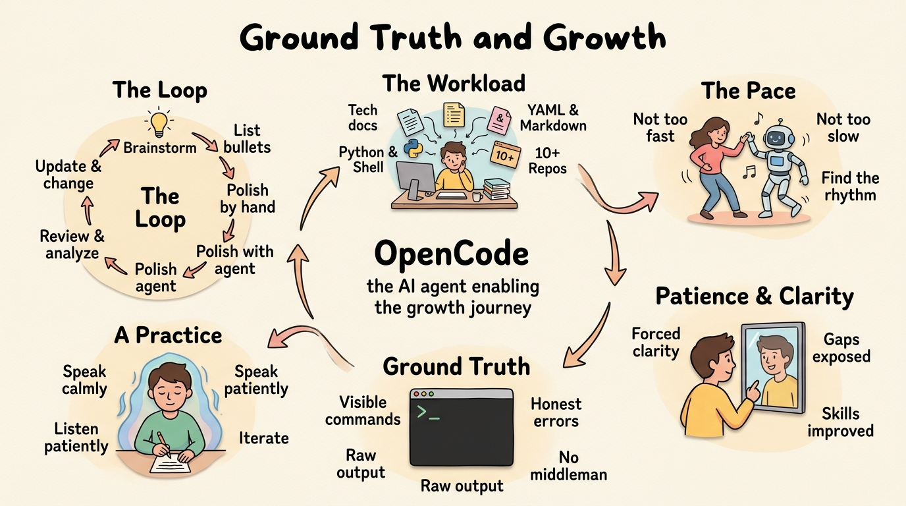

I need to work with AI agents — writing tech documents, coding in Python and shell, producing YAML and markdown, mostly in English and occasionally in Chinese, and reviewing and organizing my ten-plus git repositories and projects. That's the workload. The question was which agent to pick. I chose **OpenCode**.

OpenCode handles the writing and codifying, generates images, checks wording, and does all the tedious formatting work that used to eat my afternoons. But the real skill wasn't learning the tool — it was learning **the pace**. AI works fast, and I'm an impatient person, so I had to learn to harness it without getting ahead of myself. Not too fast, not too slow. Find **the rhythm** where the agent keeps up but I stay in control. That balance turned out to be the hardest part, and the most important.

What I learned from working with AI surprised me. I learned **patience** — not from a self-help book, but from watching a machine do precisely what I asked, and realizing that the gap between what I wanted and what I got was almost always my fault. The agent is precise. It understands instructions with a literalness that forces you to be clear. And in that forced **clarity**, I improved. I learned Git automation and GitHub Actions — things I thought I'd already mastered, but hadn't. Working with the agent exposed the gaps in my understanding and filled them, one command at a time.

The deeper gift was learning Git itself, not just the surface commands. I've been a heavy Linux user for decades, and most of my work lives in the terminal — that's the authentic Linux experience, the open-source life I always wanted. The terminal gave me something GUIs never could: **ground truth**. Every command is visible, every error is honest, every output is raw. The terminal tells me where the actual data goes, which data center it lands in, what the system actually did. There's no polite wrapper hiding the truth. It's the most honest conversation I know — me and the machine, no middleman.

And somewhere in that honest exchange, something shifted. Working with the agent improved my writing — not just technical documentation, but literature. Describing, arguing, convincing with evidence. The discipline of making an agent understand what I meant forced me to write better. And there's a meditative quality to it: you speak calmly, you listen patiently, you iterate. It's not just productivity. It's **a practice**.

The workflow settles into something like this: brainstorm the idea, list the bullets, polish by hand, polish with the agent, review and analyze together, update and change back and forth. It's not linear. It's **a loop**, and that loop is where the real work happens. It's also, somehow, fun.

```
    brainstorm
         │
         ▼
    list bullets
         │
         ▼
    polish by hand ◄──────────┐
         │                    │
         ▼                    │
    polish with agent         │
         │                    │
         ▼                    │
    review & analyze ──► update & change
```

btw, i use arch
