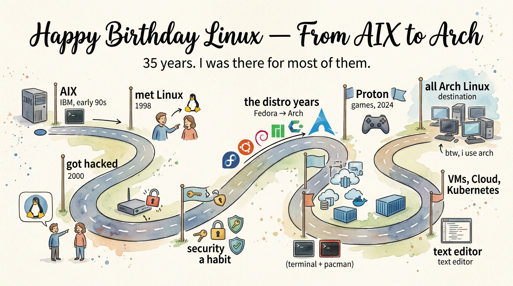

35 years. **I was there for most of them.**

Disclaimer
- Only and one hundred percent personal opinion and experience
- No intention to debate which distro/ environment/ terminal are good or bad
- They're just my personal preference, nothing else

A note on how I think
- Minimalist — I try hard to remove bloatware
- Sensitive to security (encryption) and privacy
- Open-source hard-cored

## Where It All Began

I started to work at IBM in the early 90s of last century and **first learned** that AIX existed.

I only knew Microsoft Windows. The first time I knew Linux was around 1998 when one of my teammates told me he'd try **Linux for fun**.

In 2000, I luckily joined IBM software lab in Toronto, Canada and had the chance to **touch Linux** as WebSphere, one of IBM's major middleware products, needed to work on Linux.

I also began to record in a document that goes back to that time — https://github.com/j3ffyang/instguid — for the command and configs that help me to recall and remember from **one single place**. That repo doesn't look very polished, however, it's in pure text and can be retrieved in command line, which is enough when sitting at customer's site.

I still remember that Lotus Notes was the main communication tool used at IBM entirely and it was unluckily the last main software not ported on Linux. I had to use an **emulator** to run a Windows version of Lotus Notes on my Linux. In my memory, Lotus Notes eventually supported a browser version so I don't have to install a virtual machine player.

## Getting into Linux Security

At that time I ran Red Hat **personal edition**.

I **got hacked** while installing over modem in 2000, several times. At the beginning, I surprisingly found `ls` didn't give the true list of binary files; then I ran `tripwire` to detect compromised binaries, and realized they had been replaced.

Then I spent lots of spare time to dig `gnupg` and `pgp` for encryption. Now I use `veracrypt` and `luks` for **disk encryption**.

`openssh` then became a **must to master**, alongside `rsync`, quickly replacing `ftp` and `telnet`.

I researched the Linux kernel and wrote lots of scripts using `ipchains` (kernel 2.2) then `iptables` (kernel 2.4 and after), which really helps me to understand **network traffic logic**.

From then on, security became **a habit**, not a one-time fix. The tools stuck too — I still encrypt every disk with `veracrypt` and `luks`, and no remote session without `openssh`. And the firewall logic I built with `ipchains` and `iptables` proved exactly right later in cloud computing, where a VM's network lives inside the host's network and must **stay isolated** while still reaching the outside.

## The Distro Years

I remember when working on cloud computing development at IBM software lab, I created an image of Fedora and used it as a standard virtual machine image. Eventually I noticed it **crashed** with too many open files, as its default does not have a limit of `fs.file-max` in the Fedora kernel, if my memory is correct. Then I realized I had to use **enterprise Linux** as RHEL, which became the lab's official standard Linux operating system for products.

At work, I lived on SuSE and RHEL for **official product hosting** and image OS.

I'm a sort of **Linux distro hopper**. For many years I went back and forth between Fedora and Ubuntu, then stayed with Debian for years. And in the last 8 years: Manjaro, then CachyOS shortly, then Arch. SteamOS lasted only 1 day — it's immutable and doesn't allow me to install what I want.

Now I stay with Arch Linux, which offers **minimal installation** (fewer dependencies) and high customizability. My principle on Linux is I **dislike bloatware** — `gnome-games`, for example. I do not hate them, but they are completely useless and annoying to me. I don't want to have them from the very beginning.

## Compiling Source Code

I compiled source code by hand and created **soft-links**. That happened many years ago, because the tested packages didn't catch the very latest source code. So I had to download and **compile myself**, then create soft-links so Linux could find them by default — OpenSSL and PostgreSQL, for example. I managed installed packages manually.

## Desktop Environment

I used `xfce` as a **lightweight desktop environment** when I had ~4G RAM.

I prefer `gnome` over `kde` and use `gnome` as primary DE for all distros, Fedora, Ubuntu (not Unity), Manjaro, because `kde` looks **too similar to Windows**.

After being inspired by Omarchy Linux, I **moved to `hyprland`** that I've used as primary DE for one year.

## Terminals and Default Shell

I mostly used `terminator` for **almost 20 years**, which has to be post-installed separately. Sometimes I used `gnome-terminal`. I tried `zsh` with `oh-my-zsh` for quite some time, however, I'm stupid enough — `bash` — for me. Now I use `kitty`.

## Package Manager

For years I went from `rpm` to `dnf`, and from `apt` and/ or `aptitude` (I don't understand their essential difference still). Right now it's `pacman` and `yay` (`yay` is an AUR helper wrapping `pacman`), which I think is the **most unfriendly package manager** on Linux. But I have no choice if I'm sticking with Arch. I never use a GUI package manager — I want to see the messages directly from the terminal, and I used to configure the repo's location the same way.

## Virtual Machine, Cloud Computing, then Kubernetes

I tried VMware, then completely switched to Xen, then KVM (`virt-manager`) with OpenStack. Honestly it was not as friendly as VMware. However it's **open-source, so that's our choice**.

The networking underneath: a VM's network should be **isolated as private**, and simultaneously the VM's request to outside has to be allowed to go through its host network via private network address translation (NAT).

After I entered the Cloud Computing era, almost everything **runs on Linux**, even Azure data centers use Linux on their hosts as standard.

Then Kubernetes came in and started to manage all resources in a more standard way — **declaratively in YAML** — on a **finer-grained** computing model.

## Game is a Big Thing

I like **PC games**. Bear with me, I used to play:

- Red Dead Redemption 2
- Splinter Cell: Blacklist
- DCS (digital combat simulator)
- Mafia I/ II/ III (would like to try Old Country later)
- not many, but mostly these

That was a reason I had to keep a Windows partition for them. In 2024, I mistakenly screwed up my `grub` configuration and the Windows partition was gone; **I tried Steam on Linux**. Surprisingly Proton, the emulator, works perfectly on Linux with Arch (Steam's default base OS), with Nvidia 4090 and later with AMD Radeon RX GPU. Mostly works out of the box and requires a little tweak.

Anyway, I **wiped out ALL Windows things** on all of my machines, actually 4 machines, one ROG Zephyrus G14 (Nvidia 4090 16G VRAM), one GPD Win4 (AMD Radeon 24G VRAM), one customized desktop (Nvidia 3070) and an old Dell XPS with only integrated GPU; they're all Arch Linux.

I'm happy having **one unified operating system** and never worrying about dual-boot and Microsoft unexpected updates without getting user's approval, as they think user is always stupid. All my machines are managed well in the same way. The only difference is their proprietary drivers for GPU :-P

## IDE

I'm a heavy user of `vi` and `vim`. I usually enable a Python IDE inside vim, with auto-complete, LSP (language server), lint, auto-indent, etc., so I can write Python in a Vim IDE **in the terminal**.

Every software engineer needs an IDE. I started with Atom Editor (https://atom-editor.cc/ — archived in 2022, after Microsoft VS Code **became dominant**), then had to use VS Code, then Cursor Editor, with several extensions for daily use.

I stopped using Cursor's agent since it didn't support customized LLM provider(s). I only use it now as a **markdown and code renderer**, with PlantUML diagrams.

Currently I use OpenCode as my agent, which allows me to choose various AI providers and models, with OpenRouter as a **unified payment gateway**.

## Anyway, Happy Birthday Linux

btw, i use arch