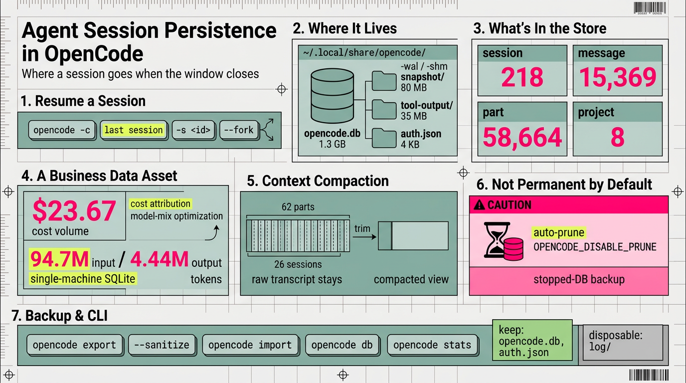

*OpenCode v1.18.34.*

Where a coding-agent session goes when the window closes: how `opencode -c` resumes it, why the accumulated store is a business data asset at team or org scale (§2), where the bytes live, what can be reused, when to purge, and how to back it up.



## 1. What a session is, and what `-c` resumes

A **session** in OpenCode is one conversation thread: an ordered list of messages, each split into typed parts. The verified part types are `text`, `tool`, `reasoning`, `step-start`, `step-finish`, `patch`, `file`, `compaction`, and `agent`, and messages themselves carry only the `user` and `assistant` roles. `opencode -c` (or `opencode --continue`) resumes the **last session**; `-s <id>` / `opencode --session <id>` resumes a specific one. The help text does not say whether "last" is scoped to the current project, so that stays an open question. `--fork` copies the session into a new one before continuing, leaving the original intact, and the mini interface can cap or disable the history replay with `--replay-limit` and `--no-replay` — mini/TUI flags that are not on the main CLI page.

## 2. The stored session log as a business data asset (team / org)

Persistence is not only "resume my chat." At team scale the database is a **structured, queryable record of work** — and that is where much of its value sits.

On this machine, as of 2026-10-04, the store held **218 sessions**, every one carrying `model` and `agent`, of which **132 had a non-zero `cost`**; the log totalled **$23.67** over **94.7M input / 4.44M output tokens**. Those figures come from columns `session` already maintains — `cost`, `tokens_input/output/reasoning/cache_read/cache_write` — alongside `time_created`/`time_updated`, `project_id`, `agent`, and `model` (stored as JSON with `id`, `providerID`, and `variant`). Because the data is already structured, cost attribution and chargeback need no transcript parsing:

```sql
SELECT p.worktree,
       json_extract(s.model,'$.id') AS model,
       COUNT(*)                     AS sessions,
       ROUND(SUM(s.cost), 2)        AS cost_usd,
       SUM(s.tokens_input + s.tokens_output) AS tokens
FROM session s JOIN project p ON p.id = s.project_id
GROUP BY p.worktree, model ORDER BY cost_usd DESC;
```

That rollup is the basis for showback and chargeback, for budget alerts, and for spotting where a cheaper model would do (model-mix optimization). Session counts and token volume per project also show which workflows the agent actually accelerates — and which are heavy for little return. The transcript is a forensic trail too (the exact command, timestamp, and triggering message), as used in the persona/scratch-artifact postmortem. And messages and parts are a corpus of real problem→solution pairs; semantically indexed (§11), they become an internal knowledge base or onboarding material.

The realistic gap is aggregation: this is a **per-user, single-machine SQLite file** with no built-in cross-developer or cross-machine rollup. True org analytics means collecting these stores (or `opencode export` dumps) into a warehouse — Postgres/pgvector, BigQuery, and so on — which is a project, not a feature. The counterweight is sensitivity: the same data holds source, secrets, and customer context, so retention, access control, and redaction are prerequisites, not afterthoughts; `--sanitize` is not a ZDR or privacy guarantee — see [`260927-opencode-openrouter-model-selection.md`](https://github.com/j3ffyang/ai-thoughts/blob/main/docs/260927-opencode-openrouter-model-selection.md).

## 3. Where it is stored

Everything lives under the XDG data dir, `~/.local/share/opencode/` (the path prints from `opencode db path`). The store is **a single SQLite database**, not a directory-per-session: `opencode.db`, plus its `-wal` and `-shm` sidecars. On this machine `opencode.db` measured **1.3 GB**, with `log/` at 28 MB, `snapshot/` at 80 MB, `tool-output/` at 35 MB, and `auth.json` at 4 KB (mode `600`). Persistence is **not permanent by default**: OpenCode prunes old data unless `OPENCODE_DISABLE_PRUNE` is set, so older sessions can be reaped automatically, and `OPENCODE_DISABLE_AUTOCOMPACT` likewise turns off automatic compaction (§6).

## 4. Directory and schema structure

`opencode.db` holds sessions, messages, parts, todos, shares, permissions, projects, credentials, and events. Beside it, `snapshot/<project-id>/` is one git snapshot repository per project — the top-level directory names match `project.id` — which appears to power revert (inferred), with a nested path-hash level under `global/`. `tool-output/` holds large tool results spilled to disk (files named `tool_<id>`) and referenced by parts; `log/` holds runtime logs (rotation unverified); and `auth.json` holds provider credentials, a secret to be neither printed nor committed.

The key tables, verified with counts as of 2026-10-04, are `session` (218 rows), `message` (15,369), `part` (58,664), and `project` (8), plus `todo`, `session_share`, `session_context_epoch`, `permission`, `workspace`, `credential`, and `event`. A `session` row carries `project_id`, `workspace_id`, `parent_id` (for forks and child sessions), `slug`, `directory`, `path`, `title`, `version`, the token and cost counters, `revert`, and `time_archived`. Both `message` and `part` store their payload as a `data` JSON blob keyed to `session_id`, which is why an ad-hoc SQL query can reconstruct a full transcript. The schema is **internal and unstable**, so do not build tooling on it without pinning the OpenCode version.

## 5. How resume works (mechanism)

On startup, OpenCode resolves the project (by `worktree`) from the `project` table, picks the session, loads its messages and parts in `time_created` order, and rebuilds the model context — though that is inferred rather than read from source, as is the on-demand re-hydration of attachments, snapshots, and spilled `tool-output`. State scoping, by contrast, is verified: `todo` rows are session-scoped and die with the session, while `permission` rows are keyed by `project_id`, so an "always" approval persists across sessions in that project (see [`260811-agents-opencode-config.md`](https://github.com/j3ffyang/ai-thoughts/blob/main/docs/260811-agents-opencode-config.md)); durable rules live in config and `AGENTS.md` (see [`260821-agents-md-not-a-persona.md`](https://github.com/j3ffyang/ai-thoughts/blob/main/docs/260821-agents-md-not-a-persona.md)). The DB is also the forensic record — the exact command, timestamp, and triggering user message — which is the trail used in the persona/scratch-artifact postmortem.

## 6. Context compaction (long sessions)

A long session eventually exceeds the model's context window, so the agent **compacts**: it summarises and trims the history so the same thread can keep going. The store shows compaction at work — `part` rows of type `compaction` numbered 62, spread across 26 sessions on this machine, plus a `session.time_compacting` timestamp column and a `session_context_epoch` table (present but empty here; its exact role is inferred). This matters for persistence because the **raw transcript stays in the DB**, while what the model *sees* on resume is the compacted view: persistence preserves the record, compaction reshapes the working context.

## 7. What else you can do (CLI surface)

Beyond resuming, the CLI can manage and move sessions. `opencode session list` lists them, and `opencode session delete <id>` removes one. `opencode export [sessionID]` writes a session to JSON, and `--sanitize` redacts sensitive transcript and file data; `opencode import <file|url>` restores a session from that JSON or from a share URL. `opencode db` runs a SQL query against the store, and `opencode stats` reports token and cost aggregates (`--models`, `--project`, and `--days` break them down). Sharing has **no standalone `opencode share` command** — it is done via `opencode run --share`, the `OPENCODE_AUTO_SHARE` env var, or the TUI, and the resulting link is recorded in the `session_share` table.

## 8. Reuse: when a session helps, and when to start fresh

A session helps when you are continuing a long task, resuming after a crash, or forking to try an alternative without losing the original. It hurts when the work is unrelated: stale history inflates the context and dilutes the prompt, so the rule is "new task → new session." Forking is the cheap way to branch a decision tree, and the original remains the record.

## 9. When you can ignore it

Some sessions are not worth keeping: read-only Q&A threads with nothing to preserve, or sessions whose value you have already codified into `AGENTS.md` or a `SKILL.md` — the durable artifact is the file, not the transcript. After `opencode session delete` (which cascades to messages and parts via foreign keys), nothing should remain; verify.

## 10. Backup — what matters and what is disposable

Keep `auth.json` (the credentials) and `opencode.db` (the history). Because old data can be pruned automatically (§3), a copy of the DB taken while OpenCode is stopped is the only durable whole-history backup; per-session exports cover only the sessions you chose to keep. `log/` is disposable, while `tool-output/` and `snapshot/` are large but should not be casually deleted — the spilled tool results are referenced by parts, and the snapshots are git repositories that capture past states for revert and do not regenerate. Backup, then, splits by intent: `opencode export <id>` (optionally `--sanitize`) to share or archive a **single** session, or a stopped-DB copy for a **full** backup (SQLite's WAL can make a live file copy inconsistent — untested here), since no bulk-export command is documented. This mirrors the Hermes pattern in [`260528-hermes-backup.md`](https://github.com/j3ffyang/ai-thoughts/blob/main/docs/260528-hermes-backup.md) — config, sessions, and auth as the essentials.

## 11. Optional: vectorization / semantic index over history

The DB is a searchable transcript store, and the obvious extension is to embed messages and parts for semantic search. A local route would be `sqlite-vec` or FTS5, but the DB is app-owned and open under WAL, so attaching extensions is untested and could conflict with OpenCode; Supabase (pgvector) is the hosted route. The risk is cost and privacy — indexing history means shipping or embedding source and secrets.

## Open questions

- Does `log/` rotate?
- Does share/export include file contents and tool output by default?
- Is there a supported bulk export/backup, or is it per-session only?
- How much context/token replay does `-c` incur on a large session?
- Which session does `-c` pick when multiple projects share a directory?
- What does compaction keep versus drop, and is dropped context recoverable?
- What does automatic pruning remove, and on what schedule or retention window?

## Verification commands

```bash
opencode --version
opencode db path
opencode session list
du -sh ~/.local/share/opencode/*
sqlite3 "file:$HOME/.local/share/opencode/opencode.db?mode=ro" \
  "SELECT 'session',COUNT(*) FROM session UNION ALL SELECT 'message',COUNT(*) FROM message;"
```

## Glossary

- **ZDR** — Zero Data Retention: the provider discards prompts and completions after each request (a retention guarantee, distinct from opting out of training).
- **WAL** — SQLite's Write-Ahead Log (`opencode.db-wal`), a sidecar holding recent changes before they are checkpointed.
- **XDG** — the freedesktop base-directory convention (`~/.local/share`, `~/.config`, …).
- **DB** — database; here, the SQLite file `opencode.db`.
- **CLI** — command-line interface; **TUI** — the terminal user interface (`opencode` with no arguments).
- **JSON** — JavaScript Object Notation; the text format OpenCode stores message/part payloads in.
- **SQL** — Structured Query Language; **FTS5** is SQLite's full-text-search extension.
- **pgvector / sqlite-vec** — vector-embedding extensions for Postgres and SQLite.

## Sources

- OpenCode v1.18.34 CLI help: `opencode --help`, `opencode session --help`, `opencode export --help`, `opencode import --help`, `opencode db --help`, `opencode stats --help` (retrieved 2026-10-04).
- Live SQLite schema: `opencode db path` → `~/.local/share/opencode/opencode.db`.
- Cross-links: [`260811-agents-opencode-config.md`](https://github.com/j3ffyang/ai-thoughts/blob/main/docs/260811-agents-opencode-config.md), [`260821-agents-md-not-a-persona.md`](https://github.com/j3ffyang/ai-thoughts/blob/main/docs/260821-agents-md-not-a-persona.md), [`260528-hermes-backup.md`](https://github.com/j3ffyang/ai-thoughts/blob/main/docs/260528-hermes-backup.md), [`260927-opencode-openrouter-model-selection.md`](https://github.com/j3ffyang/ai-thoughts/blob/main/docs/260927-opencode-openrouter-model-selection.md).

btw, i use arch
