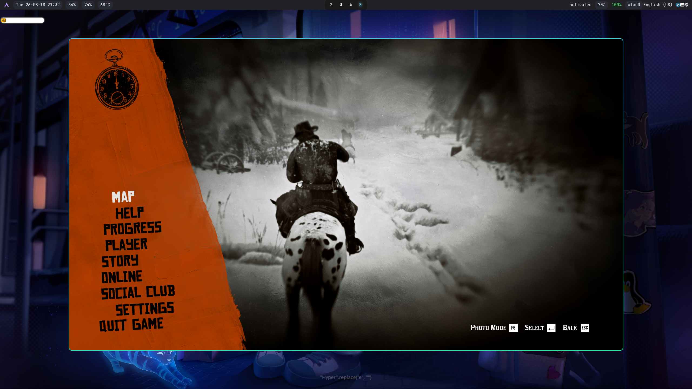

Red Dead Redemption 2 is my favorite game, and I've put several hundred hours into it over the years — enough that I already know most of the story, the people, the missions, and the events. Recently I started a fresh playthrough, and this time I decided to bring an AI agent along. Not to play for me, but to document the run: to look things up, answer in-game questions, and keep the notes while I play.

> **Spoiler warning:** this is a personal playthrough log. Expect story, mission, and character details.


## Background

- Normally I'd search the web — Google, YouTube, IGN, Fandom — for a trick or a hint. Now I search inside the agent instead — here, OpenCode.
- Then I summarize the experience into a playthrough note, just for fun.
- Most of the time I don't need Google at all anymore. YouTube still helps occasionally: when the agent tells me where something is, a video or a map image is easier to understand than a text description, because the agent is all text.

## The layout: Cursor on the left, OpenCode on the right


My desktop is Arch Linux. On the left is the Cursor editor — **I don't use its agent**, just its Markdown rendering and viewing. On the right is my agent, **OpenCode**, where the questions and the notes happen.

## An AGENTS.md and a custom SKILL.md

The automation is two files: a rules file (`AGENTS.md`) and a skill (`SKILL.md`). The intention is to automate documentation while playing.

The skill is `rdr2-playthrough` — published on ClawHub at [clawhub.ai/j3ffyang/skills/rdr2-playthrough](https://clawhub.ai/j3ffyang/skills/rdr2-playthrough), with its source in the repository at [`.opencode/skills/rdr2-playthrough/`](https://github.com/j3ffyang/ai-thoughts/tree/main/.opencode/skills/rdr2-playthrough). It maintains the Chapter 2 playthrough notes: logging an acquisition, answering a location or crafting question, and checking the notes for duplicate or stale information. Its rules are strict in the ways that matter — verify game facts before writing them down, propose the exact edit and wait for my approval before touching the notes, and keep one fact in one place.

The `AGENTS.md` is the local constitution for the notes folder (it also governs the rest of the GPD Win4 knowledge base). Its most important rule is the one that keeps this safe: nothing is committed, pushed, or published without an explicit request. Both files are deliberately boring — the point is that the workflow runs itself while I'm playing, not that the configuration is clever.

A concrete example: I say "got 3 gold bars from the Strange Statues puzzle", and the agent proposes a one-line edit to the Gold Bars table — then waits for my go-ahead before writing it. It doesn't guess a location or a price; if it isn't sure, it checks first and says so.

The notes it produces are published here as a reference: [RDR2 Chapter 2 Playthrough Notes](https://github.com/j3ffyang/ai-thoughts/blob/main/docs/260921-rdr2-ch2-playthrough.md).

## Linux is the perfect platform



I play everything on Arch Linux, RDR2 included — here on a GPD Win4 running Arch + Hyprland, with Steam/Proton doing the heavy lifting. The screenshot shows the game running on Linux, windowed on Hyprland (that's why the desktop is visible around it); it runs full screen just as well. Linux has become the perfect platform for my games: one machine, one desktop, and the same tools I already use for everything else.

## Appendix: the RDR2 rules (`AGENTS.md`)

The rules file that governs the notes is the folder's `AGENTS.md`. Trimmed to what is RDR2-specific, it reads:

```markdown
# RDR2 playthrough notes — local rules

**Local and private.** This is a local knowledge base; nothing is committed, pushed, or published without an explicit request.

## Platform
- RDR2 runs on Arch Linux + Hyprland via Steam/Proton.
- Use the machine as a standard Linux PC (keyboard/mouse), not as a handheld.

## Notes
- Keep notes as simple as possible — one fact, one place.
- Alert about duplicated info found; never silently delete or merge.
- Escape `$` as `\$` in Markdown tables.
- Notes follow `YYMMDD-topic.md` (e.g. `260921-rdr2-ch2-playthrough.md`).

## Skill
- `rdr2-playthrough` maintains the RDR2 Chapter 2 playthrough notes (`docs/260921-rdr2-ch2-playthrough.md`); it loads automatically on log/lookup requests.
```

btw, i use arch
