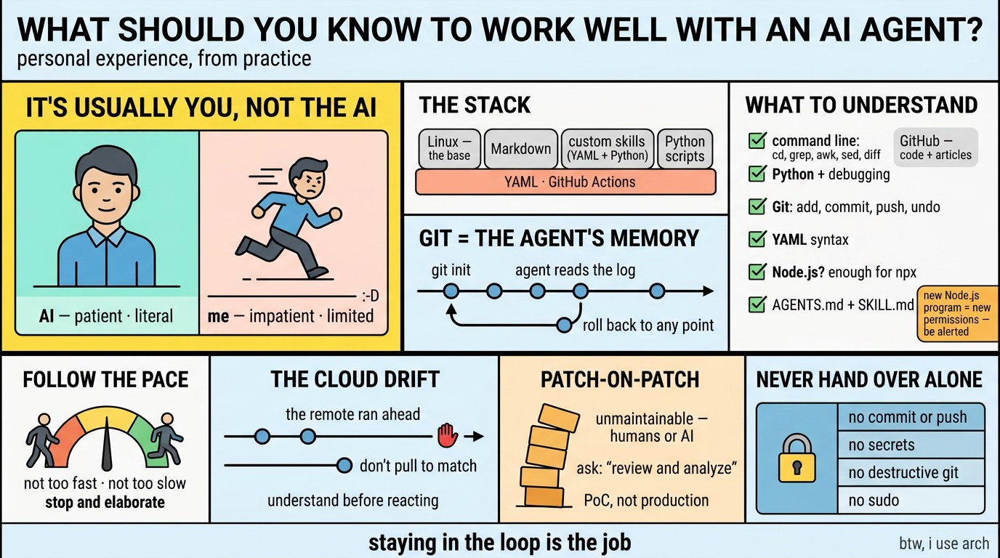

# What Should You Know to Work Well with an AI Agent?

This is a very broad topic, so I can only share my experience from my own practice.

Whenever the work turns out worse than expected, it usually isn't the AI's mistake. Most of the time **it's you** — you didn't describe your expectation clearly enough, so the AI didn't understand you.

AI is always patient and literal. Unlike me: impatient, limited in knowledge, and arrogant :-D. So you need to talk patiently and calmly, and try harder to describe things clearly and literally.

It also helps to know, generally, how an AI agent works — technically, and specifically in your own setup. What follows is the short list of what I actually needed to know — plus a few things I only learned the hard way.

In my personal project, the raw material is simple:

- Linux — an open-source base under all of this, and a reasonable place to start. It has been my primary workstation for work and personal use for years. Windows lived on my disk only for games, and fortunately it was completely ditched four years ago.
- Markdown
- custom skills with frontmatter — mostly YAML, with Python embedded
- Python scripts for automation — code the agent can run directly
- YAML workflows for GitHub Actions — where the automation actually runs
- GitHub to manage all the work — where the code and the articles get published

## The agent knows your history

`git init` turns the project into a git repository, and from then on the agent can read your whole history and roll back to any point in it.

That matters more than it sounds. Because the history is there, I don't have to remember what changed or when — I can ask "what changed in this file, and why?", or "roll this back to before that edit", and the agent reads the log and does it. The repository remembers for me; the agent is just the one who reads it.

## A surprise: the cloud was ahead of me

Earlier this month I set up an automated workflow that keeps my GitHub profile page in sync: GitHub Actions commits a generated README directly on the remote. The side effect caught me off guard: my **local** copy ended up one commit behind. The remote had a commit my disk never had, and I had never imagined that could happen.

My instinct was to `git pull` and "fix" the gap. Instead I stopped and asked what the gap actually meant. The answer: the machine commits a file I never edit by hand, so my local copy being behind changes nothing about my work — the lag is expected, and harmless.

So I wrote it down in `AGENTS.md`: don't `git pull` just to make the numbers match; the drift is by design, and syncing it back only adds noise. The lesson wasn't "run this command" — it was to **understand why** the state looks wrong before reacting to it.

## What you need to understand

- Linux — when the agent pops up `cd`, `grep`, `awk`, `sed`, `diff`, and so on, **you know what's going on**.
- How Python works, and **how to debug** when you see an error message.
- Git — `git add`, `git commit`, `git push`, even `gh secret list` sometimes; and **how to undo** changes, and how to untrack unfinished artifacts.
- YAML format and syntax — the entire config surface of the workflows you depend on.
- Node.js? At least **enough to read a failed `npx` test**.
- Understand `AGENTS.md`, know how to create a custom `SKILL.md`, and then **modify and optimize it** when requirements change. Check for and remove duplicated info, and avoid conflicts between `AGENTS.md` and `SKILL.md`.

With Node.js you also need to understand the workflow, the dependencies, and what the error messages actually mean — and be extra careful whenever a new Node.js program is downloaded and executed, because it can grant itself far more permission than you would ever hand out on purpose. My [Brisova-malware article](https://github.com/j3ffyang/ai-thoughts/blob/main/docs/260929-brisova-malware-analysis.md), written several days ago, is exactly that case: an ordinary-looking build step that quietly fetched and ran a payload. Be alerted.

You don't have to master all of them — at least you should know what is running in front of you, with the AI agent.

## The agent works better if you follow its pace

The AI is generally faster than my own work pace, so what I have to keep up with is my own cadence — and the sheer amount of work it offers to do. Git commands, file edits, searches, scripts: there is a lot of movement behind a single answer.

So neither too fast nor too slow. And a lot of the time I need the agent to stop and elaborate a bit, for better clarification and understanding.

After working with the agent for months, it may understand you better and know what it can do without asking you. But I also want to learn from the agent.

## The patch-on-patch worry

I won't let an AI agent work on a big project unless I stay engaged myself. I've heard of people leaving the agent working overnight; the next morning, the result looks okay.

That sounds good, but it scares me. Over a night of unattended work, patch follows patch — and you don't know how many have accumulated, or how deeply they stack. Eventually the code can't be debugged, and is even hard for human eyes to review.

The reason it piles up is that the agent focuses on the one issue in front of it until it's done, and won't sweep the project unless you explicitly ask — or unless your setup already tells it to. Ask it to "review and analyze the entire project (or article)", and it will always give you suggestions and options. Better still: put the review requirement into `AGENTS.md`, so every session gets it whether or not you remember to say it.

Patch-on-patch code will definitely become unmaintainable, by humans or even by AI. It's okay to run a PoC that way — but **not production**. For long-term production software, I still want code that is readable and maintainable to me.

## What I never hand over alone

The rules I don't delegate, no matter how confident it sounds:

- Never a commit, a push, or an amend. I decide what gets staged — and untracked files are always work in progress.
- Never a secret. Keys and tokens stay out of the repo, and out of the agent's reach.
- Never a destructive git command — no force-push, no `reset --hard`, no rewriting history without my explicit go-ahead.
- Never `sudo`. And never a blanket `chown`/`chmod` to "fix" a permission error — an error is a clue, not a licence to escalate.

These four are **rules, not preferences** — which is exactly why they are written down instead of remembered.

## Closing

Nothing here is about the model. Every item is about me knowing enough to say what I want — which is the job I claimed at the top of this post.

The agent can read the whole history, write the file, and run the command. It cannot decide what "clear" means for your project, notice that a number looks wrong, or tell a PoC from something you will still own in a year. Those three are yours, and they get cheaper with practice — but only if you stay in the loop.

The skills are just leverage. Staying in the loop is the job.

btw, i use arch
